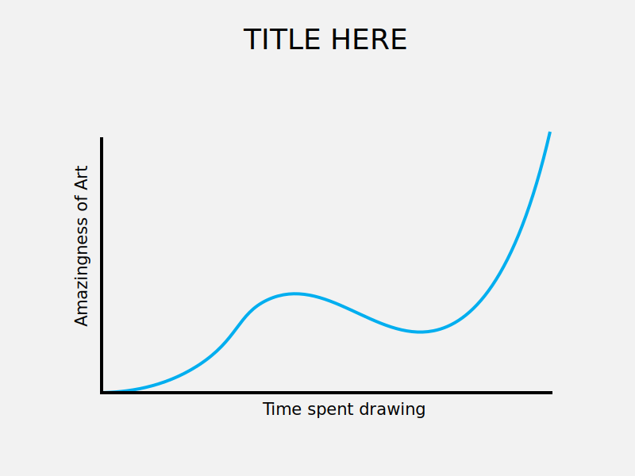
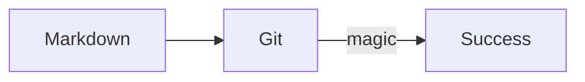

# Extensions How-To

Below, you can see a demonstration of all extensions that have been activated in the default `mkdocs.yml` file.

## Syntax highlighting

The code block also demonstrates the copy code, annotation, mark text and keyboard keys functionalities

```python
import os

a = os.name + '-' + 'cat' # (1)
print(a)
```

1.  :cat: I'm a code annotation! I can contain `code`, **formatted
    text**, images, ... basically anything that can be written in Markdown.

Clicking the ==Copy to clipboard== saves you from a tedious ++ctrl+c++ process.

:book: The syntax highlighting supports all languages supported py Pygments. The full list is available [in Pygments docs](https://pygments.org/languages/)

# Admonitions

!!! tip

    You can add longers tips inside their own container blocks using `!!! tip "Headline"`, including an optional headline.

!!! question "Exercise: Do it"

    Exercise: It must be done.

??? note

    You can add longers tips inside their own container blocks using `??? <admonition>`. Note that there must be an empty line before and after the admonition line. The adminition text body must be indented with 4 spaces.

!!! quote

    The way to get started is to quit talking and begin doing. *--Walt Disney*

# Images

Use relative path to images. Prefer SVG when possible. The image below is 800x600 SVG and has a solid color rectangle as a background to make sure any text is visible in day/night mode. The color of the background is `HSL(0,0,90)` which results to `rgb(231,231,231)`.


**Figure 1**: *Beautiful corner blobs with lots of negative space. Meaningful text in the middle. Absolutely splendid artwork.*

This is an example paragraph showing how the text flows after a caption. Lorem ipsum dolor sit amet, consectetur adipiscing elit. Duis eget arcu sed elit euismod fermentum eu a sem. Cras eu imperdiet urna. Praesent pulvinar metus ac justo faucibus, vel elementum ligula hendrerit. Lorem ipsum dolor sit amet, consectetur adipiscing elit. Praesent ut ex libero. Integer mollis turpis porta ligula tempus, quis sodales dolor placerat. Praesent non diam vestibulum, dictum risus vel, tincidunt magna.

## How to: Affinity Designer

Toggle the "Force Pixel Alignment" on when creating artwork. After it is done, export using preset: `SVG (for export)`.

## How to: Adobe Illustrator

Create a New Document with the following settings:
* Units: Pixels
* Color Mode: RGB
* Preview Mode: Pixel

Also, set on the: `View => Snap to Pixel`.

After the artwork is done, export using: `File => Export => Export As... => SVG`. Toggle both ==Minify== and ==Responsive== on. Proper amount of decimal places is 1. Most of your objects should match to the pixel grid anways since the "Snap to Pixel" is on.

## How to: Excalidraw

Excalidraw's font is causing problems, so you may want to use PNG. However, you should also save the `*.excalidraw` file to `images/` for future editing. You can simply drag and drop the file to the Excalidraw's web editor to open it.

To export the PNG, remember to have the `Background [x]` on. Otherwise the graphic will be transparent and the text or lines may not be visible in dark mode.

## A More Elaborate Example

Below is a line diagram created in Adobe Illustrator and exported as SVG. The background color is HSB(0,0,95) in this case which results to `rgb(242,242,242)`.


**Figure 1**: *Beautiful corner blobs with lots of negative space. Meaningful text in the middle. Absolutely splendid artwork.*

# Mermaid Graphs



:book: Check more at [Mermaid Tutorials](https://mermaid.js.org/config/Tutorials.html)
