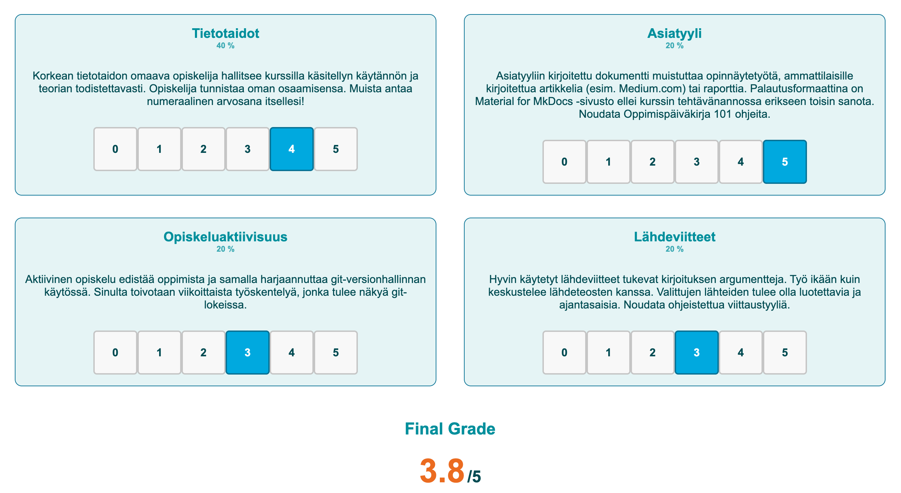

# Itsearviointi

## Arvosanan perustelut

Kirjoita tähän **realistinen** itsearviointi. Huomaa, että arvioithan **itsesi** etkä **kurssia**. Perustele siis, miksi ansaitset mielestäsi arvosanan `x/5`, ja mitä olisit kenties voinut tehdä toisin, jotta arvosana olisi korkeampi. Kuinka muutat toimintaasi tulevilla kurssilla? Ohjemitta itsearvioinnille on noin 200–400 sanaa.

Sanallisen arvion ==lisäksi== anna itsellesi myös numeraalinen arvosana. Käytä arvioinnin perustana virallista [Arviointityökalua](https://arviointi.munpaas.com/), joka löytyy osoitteesta. Liitä arviointikriteerit joko **teksti- tai kuvamuotoisena** arviointityökalusta tähän. Alla esimerkki kummastakin. Itsearvioinnin kirjoittaminen on osa kurssisuoritusta. Jos se puuttuu kokonaan, sillä on laskeva vaikutus arvosanaan. Älä siis jätä itsearviointia kirjoittamatta!

### 🗒️ Tekstimuotoinen arviointikriteerien liittäminen

**Tietotaidot**: 4 - Opiskelija käyttää kurssilla vaadittuja taitoja ja yhdistää ne teoriaan ja itse löytämiinsä ohjeisiin siten, että tietotaito on selkeästi todistettuna. Opiskelija tunnistaa oman osaamisensa tason. (40%)

**Asiatyyli**: 5 - Teksti on argumentoivaa, oivaltavaa ja lähes virheetöntä asiatyyliä. Tekstin, kuvien, koodin, luetteloiden, väliotsikoiden ja muiden elementtien käyttö on harkittua ja tasapainoista. (20%)

**Opiskeluaktiivisuus**: 3 - Työskentely on ollut aktiivista läpi kurssin, mutta kausittaista. Työtä on tehty noin joka toinen viikko. (20%)

**Lähdeviitteet**: 3 - Lähteitä on käytetty, ja ne tukevat opiskelijan argumentointia. Lähdeaineiston käyttö on systemaattista ja lukijalle selkeää. (20%)

**Final grade**: 3.8

!!! tip

    Tätä varten on sivustolla nappi "Copy to clipboard", joka kopioi arviointikriteerit leikepöydälle. Tämän jälkeen voi liittää ne sinällään Markdown-tiedostoon. Minä olen lisäksi muokannut yllä olevaa siten, että korostin kunkin otsikkosanan.

### 🏞️ Kuvamuotoinen arviointikriteerien liittäminen

Jos suosit kuvaa tekstin sijasta, sinun tulee ottaa ==järkevästi rajattu== kuvakaappaus kriteereistä. Ei siis kokonaista 4K-näytön työpöydän sisältöä vaan vain itse kriteerit. Alla esimerkki:

**Kuva 1:** Arviointikriteerit arviointityökalusta. Huomaa, että tämä on staattinen kuva, joten kriteerit ovat todennäköisesti päivittyneet kuvan oton jälkeen. Älä käytä tätä kuvaa arvioinnin perusteluna vaan nouda tuore kuvakaappaus.