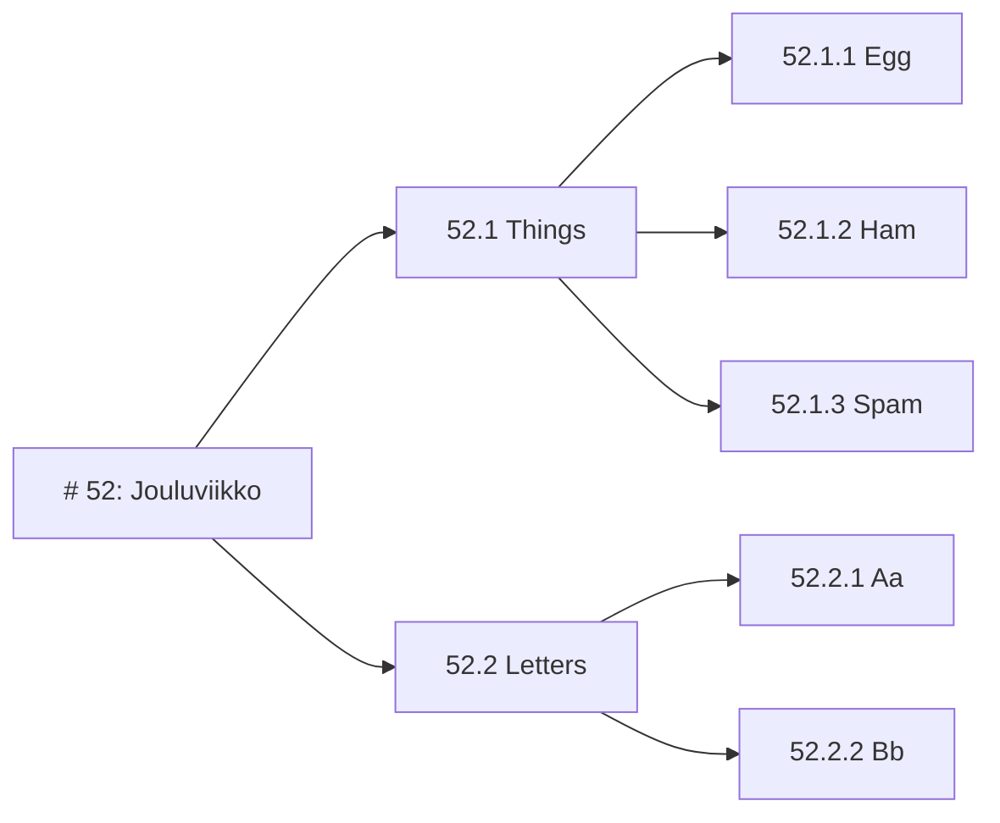

# Kurssin nimi tähän
**Etunimi Sukunimi**

Aivan oppimispäiväkirjan alkuun — eli juuri tähän — voit kirjoittaa lyhyen johdannon. Mikäli työskentelet pienryhmässä, voit esimerkiksi esitellä lyhyesti ryhmäsi jäsenet. Voit myös kirjoittaa itsellesi talteen asioita, jotka haluat oppia kurssin aikana, tai sanallistaa aiemman kokemuksesi aihepiiristä. Tämä antaa lukijalle hieman kontekstia.


## 1: Oppimispäiväkirjan rakenne

Oppimispäiväkirja koostuu useista eri **viikkotason** merkinnöistä, ja kukin niistä on toisen tason otsikko. Kukin viikkotason merkintä on laajuudeltaan noin **1 liuskan eli 500 sanaa**. Voit ylittää tuon merkkirajan, mutta älä kirjoita yli kahta liuskaa eli noin 1000 merkkiä tekstiä. Kuvia ei lasketa merkkimäärään mukaan; käytä niitä silloin, kun teksti tarvitsee visuaalista tukea.

Tason kaksi otsikko tehdään Markdown:ssa kahdella `##` -merkillä. Kirjoita siis merkintäviikon otsikko muodossa `## {{vko}}: Lorem ipsum`, jossa `{{vko}}` edustaa viikonumeroa. Tämä ohje on kirjoitettu oletuksella, että työ on aloitetettu viikolla 1, mikä näkyy yllä olevasta otsikosta. Kirjoita oma oppimispäiväkirjasi siten, että otsikko edustaa sitä viikkonumeroa, milloin kirjoitat kyseistä merkintää. Valtaosan tekstistä tulisi koostua kokonaisista lauseista, jotka muodostavat kokonaisia kappaleita.

```markdown
## 52: Jouluviikko

Tähän kirjoitat kyseisen oppimispäiväkirjan merkinnän runkoteksti. Jos tarvitset alemman tason otsikoita, käytä niitä hierarkisesti. Otsikoita ei tule kylvää liiallisesti. Käytä niitä vain, jos pitkä viikkomerkintä on tarpeellista jakaa teemallisesti eri osiin.
```

Jos tarvitset alempia otsikoita, käytä niitä hierarkisesti. Tätä on kuvattu mermaid-kuvaajassa alla. Voit luoda omia mermaid-kuvaajia sinun omaan dokumentaatioosi [^1739a4].



**Kuvio 1:** *Esimerkki sisäkkäisistä otsikoista. Ethän käydä tason n otsikkoa, jos se on ainut laatuaan. Kuvioille, kuville, kuvaajille tai muille visuaalisille elementeille on hyvä antaa kuvateksti. Tämä toimii esimerkkinä sellaisesta.*

Huomaa, että viikkoihin sidotut otsikot ovat numeroituja, mutta viikosta riippumattomat otsikot eivät ole. Näitä ovat esimerkiksi `Itsearviointi` ja `Lähdeluettelo`.

Käytä Extended Markdown-kielen Gitlab-murretta. Tämä sallii joitakin ominaisuuksia, joita ei tyypillisessä Markdownissa ole. Yksi näistä ovat **Footnote**:t, jotka mahdollistavat **Vancouver**-tyyliset lähdemerkinnät [^1739a4]. Footnoteja eli suomeksi alaviitteitä tukevat myös muut alustat ja sovellukset, jotka ymmärtävät Extended Markdownia [^e2a436]. Huomaa, että oppimispäiväkirjan rakenne on yksi arvosteteluperusteista. Tee se huolella. Alla joitakin vinkkejä listamuodossa:

* Käytä luetelmaa [^d1a7a7] kun listaat asioita.
* Käytä koodilohkoja, kun kirjoitat koodia.
* Käytä yksinkertaisiin kuvaajiin mermaidia.
* Käytä kuvia, kun haluat näyttää jotain visuaalista.
    * Kuvaajia voit luoda esimerkiksi [excalidraw](https://excalidraw.com/) -sivustolla.
    * Muistathan tarkistaa netistä löytämiesi kuvien tekijänoikeudet!

Ethän kuitenkaan laita koodia kuvina! Käydä tähän koodilohkoja. Koodilohko luodaan asettamalla koodi kolmen backtickin tai tilden sisään. Koodilohkon aloittavan blokin perään tulee kirjoitettaa käytetyn koodin kieli, jotta syntaksin värikorostuvat toimivat oikein. MarkDown-tiedostossa Python-lohko näyttäisi siis tältä:

~~~markdown
```python
# Backtick: SHIFT + ´ (the button on the left of BACKSPACE)
md = "Easy"
```
~~~


## 2: Miksi oppimispäiväkirja?

National Research Council:n komitean mukaan [^a029a4] tyypillisesti opetussuunnitelmat korostavat enemmän muistia kuin ongelmanratkaisua. Oppikirjoissa on faktoja, jotka opiskelija opettalee ulkoa, ja kirjoittaa tentissä oikeisiin kohtiin. Tämä on sekä oppilaalle että opettajalle selkeä ja helppo tapa arvioida oppimista. Ongelmaton se ei kuitenkaan ole. Kuten Bransford ja kumppanit toteaa, tämä aiheuttaa ns. kilometrin leveää ja senttimetrin syvää osaamista. Tämä tarkoittaa, että opiskelija osaa ulkoa faktoja, mutta ei osaa soveltaa niitä. Ongelma on erityisen vakava tietotekniikan alalla, jossa teknologia kehittyy nopeasti. Työntekijät odottavat työntekijöiltä ongelmanratkaisutaitoja, ei ulkoa opeteltuja faktoja [^e883b6].

Asiantuntijasta ei tee asiantuntijaa se, että hän osaa ulkoa paljon faktoja. Asiantuntijat ovat tehokkaita ongelmanratkaisijoita, tiedon etsijiä ja tiedon soveltajia. Hakkarainen ja kumppanit [^40c08c] tiivistävät, että: *"kirjoittaminen on kaikkein tärkein ajattelemaan oppimisen väline."* 2000-luvun työntekijä ei voi olettaa saavansa esihenkilöltä yksiselitteisiä työtehtäviä. Olet ammattikorkeakoulussa valmistamassa itseäsi työelämään, joten työelämän tavat toimia on hyvä ottaa käyttöön jo nyt. Oppimispäiväkirja on yksi tapa harjoitella kirjoittamista ja ajattelua sekä saattaa ajattelu näkyväksi.

Kirjoittamalla oppimista voi harjoittaa kuten Karnofsky [^7ef5f9] eli valitsemalla opittava aihe, tutkimalla aihetta, kirjaamalla **hypoteesin**, todistamalla hypoteesin oikeaksi tai vääräksi, ja toistamalla kunnes kokonaisuus kestää kasassa. Tämä muistuttaa hyvin lähelle perinteistä tieteellistä menetelmää, ja "tutkiva oppiminen" on tähän läheisesti liittyvä termi [^40c08c]. Fyysikko Richard Feynmanin mukaan nimetty tekniikka, "Feynman Techinique", myötäilee samaa kaavaa [^1fbb24], joskin lisää siihen *"explain it like I'm 5"*-selitysvaiheen.

Ei siis riitä, että osaat seurata vaihe vaiheelta eteneviä videotutoriaaleja. On tärkeää pohtia ja selvittää, **miksi** jokin asia on kuten se on. Oppimispäiväkirja on samalla askel sitä kohti, että otat omasta oppimisestasi vastuuta. Sinä olet se, joka opiskelee ja oppii. Opettaja on valmentaja ja apu.


## 3: Akateeminen tyyli


**Kuvio 2:** *Akateemista lukemista ja kirjoittamista kannattaa opetella opiskeluiden aikana. Yksi tapa on tutustua KAMK:n e-kirjaston kirjoihin. Näistä näkyy kuvassa kaksi: Akateemisen lukemisen ja kirjoittamisen opas (Vilkka H. 2020) sekä Hyvä, parempi, valmis: Opinnäytetyöopas ammattikorkeakouluille (Takala, J. 2023)*

Tämän luvun teksti perustuu kokonaisuudessaan *Akateemisen lukemisen ja kirjoittamisen oppaaseen*. Kyseisen teoksen lukeminen on äärimmäisen suositeltavaa. Akateemiseen kirjoittaminen on tiedonluomisen ja luovan ongelmanratkaisun metodi. Siihen liittyviä taitoja ovat tiedonhakutaidot, tiedonarviointitaidot sekä tiedon soveltamisen taito. Ammattikorkeakoulun koulutuksen yksi pyrkimys on, että kykenet työelämässä luomaan selvityksiä tai raportteja, joiden sisältö on johdonmukaista ja perusteltua. Koulutuksen aikana näitä tekstilajeja ovat opinnäytetyö ja oppimispäiväkirja, mutta työelämässä saatat joutua vertailemaan, mikä tarjolla olevista palveluista sopii parhaiten yrityksen käyttötarkoitukseen [^1d1c01]. Sinun tulisi osata ajatella analyyttisesti ja luoda sellainen tutkimuksellinen asetelma, joka mahdollistaa palveluiden vertailemisen systemaattisesti. Vertailun tulokset tulee osata esittää siten, että esihenkilö tai muu tilaaja ymmärtää sinun löydöksesi, ja kyetä osoittamaan, mistä olet hankkinut tietosi ja millä perusteella arvioit sen olevan uskottavaa tietoa.

Teoksessa on myös oma, hyvin lyhyt alalukunsa oppimispäiväkirjasta tyylilajina. Siitä on lainaus alla:

> "Oppimispäiväkirja on oman oppimisen reflektointia taaksepäin ja eteenpäin. Oppimispäiväkirja pyrkii olemaan kokonaisuus, jossa opintojaksolla opitun avulla pystyt laventamaan aiempaa osaamistasi tai muuttamaan oma ajattelutapaasi. Merkittävintä tekstissä ovat opintojaksolla esitetyt, sinulle tärkeät käsitteet tai teoriat, joiden olet huomannut muuttaneen ajatteluasi tai asenteitasi." [^1d1c01]

Huomaathan, että oppimispäiväkirjan tekstissä saa kuulua sinun oma äänesi. Tyylin tulee olla asiallista, mutta sen ei tarvitse olla kuivaa. Oppimispäiväkirjan saa kirjoittaa minä-muodossa.


## 4: Lähdeviittausjärjestelmän käyttö

### 4.1 Yleistä lähteviittauksesta

Lähdeviittaukset tehdään Vancouver-tyyliä **mukaillen**. Huomaa sana **mukaillen**. Opinnäytetyössä, akateemisissa julkaisuissa ja muissa raporteissa tulet noudattamaan esimerkiksi APA tai Vancouver lähdeviittausta orjallisesti ohjeiden mukaisesti. Oppimimispäiväkirjassa on riittävää, että käytät lähdeviittauksia, jotka ovat ymmärrettäviä ja johdonmukaisia. Voit käyttää tämän dokumentin lähdeviittauksia tyylillisenä ohjenuorana. Oppimispäiväkirjassa jätetään muun muassa viittauspäivämäärä pois, koska se selviää kontekstista, ja sivunumerot, koska GitLab-maustettu Markdown ei salli niiden sisällyttämistä Footnoten sisään.

### 4.2 OAT-spec

Kuten opinnäytetyön tekijän oppaassa neuvotaan [^fcfce3], lähdeviite koostuu kahdesta osasta: **tekstiviitteestä** ja **lähdeluettelon vastineesta**. Tekstiviittauksen sisällä on viittauksen tunniste, joka on tyypillisessä Vancoucer-lähdeviittauksessa numero, mutta meillä on käytössämme opinnäytetyön arviointityökalun aivan oma lähdeviittauksen spesifikaatio (lyh. OAT-spec). Saat käyttää numeroa, mutta numeroinnin ylläpito käsin on haastavaa. Meidän OAT-specin suositus on siis käyttää MD5-tiivisteeseen (eli "häshiin") perustuvaa lyhyttä merkkijonoa. Tätä on selvennetty alla olevassa taulukossa.

|                  | Vancouver                   | OAT-spec                             |
| ---------------- | --------------------------- | ------------------------------------ |
| Tekstin sisällä  | [1]                         | [^fff999]                            |
| Lähdeluettelossa | 1: Tekijä. Teos. Ynnä. Muut | [^fff999]: Tekijä. Teos. Ynnä. Muut. |

Huomaa, että lähdeviitteet voivat olla joko viitteitä, kuten edellä olevassa kappaleessa, tai suoria lainauksia, kuten tämä: "Lähteet numeroidaan lähdeluetteloon juoksevasti eli siinä järjestyksessä, missä ne esiintyvät tekstissä." [^fcfce3]

Jos pohdit, että miksi me poikkeamme Vancouver-speksistä näin rankasti, niin syy on selvä. Me emme tuota PDF-tiedostoa Theseukseen vaan Markdown-tiedoston GitLab-versionhallintaan. GitLab korvaa häshit numeroille meidän puolestamme ja tekee niistä tiedostonsisäiset linkit. Kokeile klikata jotakin tämän dokumentin tekstinsisäistä viitettä. Kokeile myös klikata lähdeluettelossa näkyviä viitteitä tai niiden perässä olevia nuolia.

### 4.3 Lähdeviitteet ja tieteellinen tieto

Tieteellisen tiedon suurin arvo ei johdu siitä, että tieto olisi totta [^40c08c]. Tieteellisen tiedon arvo on sen toistettavuudessa, läpinäkyvyydessä ja uusiutuvuudessa.  Tämän vuoksi on tärkeää, että lähdeviitteet ja hypoteesin synty ovat yksiselitteisiä ja johdonmukaisia. Wikipedia on huono lähde: sillä on useita eri kirjoittajia, ja on vaikea sanoa, mitä siellä on milloinkin lukenut kenenkin sanomana. Wikipedia on hyvä lähde tiedon pläräilyyn *ensimmäisellä kerralla*, mutta tieto pitäisi varmistaa lähteistä - ja näihin Wikipedian artikkelit itsekin viittaavat. Suuret kielimallit kuten ChatGPT tai Bard ovat vielä huonompia lähteitä kuin Wikipedia. Kielimallin kanssa keskustelusta voi saada hyviä ideoita, näkökulmia ja jopa sattumanvaraisesti oikeita vastauksia kysymyksiisi, mutta tämä ei ole millään tavoin tieteellisesti pätevä tapa hankkia tietoa. Kielimalli luo lauseita, jotka vaikuttavat oikeilta. Kielimalli ei tarkista faktoja tai punnitse tutkimustapojaan: se vain liimailee sopivia asioita yhteen.


**Kuvio 3:** *ChatGPT vastaa väärin esimerkiksi tähän yksinkertaiseen matemaattiseen tehtävään. Se suoritti matemaattiset operaatiot sääntöjen mukaisessa järjestyksessä, mutta tyri lopulta yhteenlaskun. Oikea vastaus on 14691.*

HUOM! Ethän siis käytä kielimalleja lähteinä! Se laskee arvosanaasi.

### 4.2 Lähdeviittausesimerkki

Alla koodilohkossa on esimerkki lähdeviitteestä. Käytä tätä ohjetta apuna, kun kirjoitat omia lähdeviitteitäsi.

```
# Tämä osuus on jossain runkotekstissä

Tämä kappale hyödyntää GitLab-maustettua Markdownia [^1739a4]. Markdown on sekä kehittäjäystävällinen merkintäkieli tai syntaksi että ohjelmisto, joka kääntää tätä kieltä HTML:ksi [^d1a7a7]. 

# Lähdeluettelo

[^1739a4]: GitLab Docs. GitLab Flavored Markdown (GLFM). https://docs.gitlab.com/ee/user/markdown.html

[^d1a7a7]: Gruber, J. Daring Fireball: Markdown. https://daringfireball.net/projects/markdown/
```


## 5: Teknisiä vinkkejä kirjoittamiseen

Voit halutessasi käyttää kirjoittamisen apuna eri ohjelmia ja työkaluja. Voit esimerkiksi kirjoittaa runkotekstin **Microsoft Word**:ssa, jolloin käytössäsi on oikoluku ja muut kielentarkistusominaisuudet. Tämän jälkeen voit kopioida tekstin Markdown-muotoon.

Markdown-tiedostoja voi muokata ja esikatsella **Visual Studio Code**:lla, mutta siinä eivät toimi esimerkiksi alaviite tai Mermaid ainakaan ilman lisäosia. Yksi WYSIWYG (What You See Is What You Get) vaihtoehto on kevyt editori nimeltään [Typora](https://typora.io/). Ohjelma maksaa noin 15 euroa.

Lähdeviitteiden Mikäli lähdeviitteiden numeroinnin pitäminen järjestyksessä tuntuu haasteelliselta, voit käyttää kikkaa, jossa käytät satunnaisgeneroitua tai häshättyä tiivistettä. Tällöin jonkin lähteen tunniste voi olla esimerkiksi `[^fff000]`.  Voit myös sijoittaa lähdeluettelon aluksi eri tiedostoon, jolloin sen saa editorissa side-by-side näkymään tekstin kanssa. Tämä auttaa ylös-alas vierittelyn vähentämisessä.

Pitkä kappale näyttäytyy Visual Studio Codessa yhtenä rivinä, mikä tekee tekstin lukemisesta hankalaa. Tämän voi korjata lisäämällä word wrap -ominaisuuden. Tämä kannattaa asettaa siten, että se on aktiivinen nimenomaan Markdown-tiedostojen kanssa. Avaa `View => Command Palette` ja etsi `Preferences: Open User Settings (JSON)`. Lisää tiedostoon seuraavat rivit:

```js
{
    // JSON:ssa voi olla aiemmin luomiasi asetuksia, esimerkiksi:
    // ...
    // "workbench.colorTheme": "Default Dark Modern",
    // "git.autofetch": false,
    // "editor.defaultFormatter": "esbenp.prettier-vscode",
    // ...

    // Lisää JSON:iin seuraavanlainen osuus: "[markdown]": { ... }
    "[markdown]": {
        "editor.wordWrap": "on",
        "editor.tabSize": 4,
        "editor.insertSpaces": true,
        // Jos haluat, asenna Markdown All in One -lisäosa ja lisää myös
        "editor.defaultFormatter": "yzhang.markdown-all-in-one",
        "editor.formatOnSave": true
    }
}
```

## Itsearviointi

Kirjoita tähän **realistinen** itsearviointi. Sanallisen arvion lisäksi anna itsellesi myös numeraalinen arvosana. Voit muokata arvosananumeron suureksi HTMLn avulla alla olevan esimerkin mukaisesti. Alla 500 sanaa Lorem Ipsum -täytetekstiä, jotta näet, miltä 1 liuska tekstiä eli 500 sanaa näyttää:

Lorem ipsum dolor sit amet, consectetur adipiscing elit. Etiam pretium tempus ligula ut maximus. Proin luctus ex erat, quis tempor neque commodo a. Ut non lectus gravida felis mattis pellentesque. Curabitur diam eros, scelerisque non consequat at, dapibus eu arcu. Ut consectetur id nulla quis fringilla. Vivamus rutrum lacus eu faucibus tempor. In ac aliquam dolor. Quisque vitae posuere ligula. Class aptent taciti sociosqu ad litora torquent per conubia nostra, per inceptos himenaeos. Mauris vel odio at justo scelerisque dapibus vitae vitae sem. Donec augue nibh, dapibus ut nisl in, finibus faucibus enim. Sed fringilla urna non tellus pellentesque, in tincidunt erat tristique. Cras ante lectus, tincidunt eget massa et, hendrerit lobortis tellus. Vivamus sit amet metus quis metus tincidunt congue id at tortor.

In id lobortis risus. Suspendisse eget dignissim dolor, in suscipit elit. In non tortor ut magna convallis congue. Nullam ultricies nulla eu metus imperdiet, at porttitor risus viverra. Phasellus ultrices nulla sed elit pharetra ultrices. Phasellus vulputate quam ut arcu interdum, et placerat odio rhoncus. Etiam sed ipsum pellentesque, tempus massa vel, vulputate mauris. Aenean dictum facilisis finibus. Vestibulum sapien augue, vehicula at felis in, mollis auctor lacus. Proin tempus dictum justo in vulputate. Aliquam efficitur tortor nec quam mollis, in posuere metus ullamcorper. Suspendisse aliquam nulla id tellus gravida, eget tempor felis sollicitudin. Curabitur vitae egestas odio.

Aenean ultrices non ipsum eget pulvinar. Morbi blandit risus in pulvinar facilisis. Maecenas quis ornare lorem. Pellentesque ullamcorper mi dolor, et venenatis libero euismod at. Duis vel sagittis ipsum. Integer eleifend luctus lacus sit amet volutpat. Pellentesque commodo bibendum urna, ac vulputate ligula. Pellentesque in erat pulvinar, dignissim tortor ac, finibus magna. Curabitur finibus ante eu lorem iaculis ultrices.

Nunc porta, arcu et sodales bibendum, augue ex lacinia justo, vitae eleifend diam erat ut lacus. Curabitur feugiat lectus id posuere fringilla. Vivamus at ex at sem rhoncus malesuada at nec lectus. Phasellus rhoncus congue felis, ac viverra dui venenatis quis. Proin tristique pretium egestas. Proin vehicula, mauris mollis porttitor interdum, arcu nulla scelerisque nibh, id finibus augue ante nec neque. Morbi ligula magna, pretium sit amet cursus at, feugiat quis magna. Nulla a odio vitae nibh aliquet ultricies ut sit amet augue. Donec sodales nibh ac sagittis varius. Aenean non turpis et sapien euismod viverra tempor nec quam. Curabitur non ligula id purus pulvinar convallis ac non orci. Nulla ullamcorper ex eu est condimentum vehicula. Suspendisse dapibus, urna venenatis varius viverra, est nunc convallis tellus, at ultricies massa justo ut risus. Aliquam eu dolor ac ipsum consectetur sollicitudin. Nunc rhoncus mauris est, ut lacinia purus hendrerit quis. Praesent accumsan cursus ante at imperdiet.

Nullam elementum ut lectus vel congue. Praesent ut vulputate lectus. Duis cursus accumsan viverra. Proin blandit dolor lorem, sit amet dapibus velit dictum vitae. Etiam convallis neque vitae velit tristique vehicula. Vestibulum dolor odio, ullamcorper eget tortor nec, elementum fringilla justo. Proin vel urna augue. Nulla sit amet libero ac magna ullamcorper eleifend. Nullam et tellus felis. Maecenas molestie euismod orci, quis malesuada ex tempus.

Numeraalinen arvosana: 4/5

## Lähdeluettelo

[^1739a4]: GitLab Docs. *GitLab Flavored Markdown (GLFM)*. https://docs.gitlab.com/ee/user/markdown.html
[^e2a436]: Markdown Guide. *Extended Syntax*. https://www.markdownguide.org/extended-syntax/
[^d1a7a7]: Kielitoimiston ohjepankki. *Luetelma*. https://kielitoimistonohjepankki.fi/ohje/luetelma/
[^a029a4]: Bransford, J. D., Brown, A. & Cocking, R. *Miten opimme: Aivot, mieli, kokemus ja koulu* (A. Penttilä, suom.). Helsinki: WSOY. 2004.
[^e883b6]: Myllymäki, M., Laine, S. & Hakala, I. *ICT-alan rekrytointiselvitys Keski-Pohjanmaalla*. 2023. https://cinetcampus.fi/site/assets/files/2246/ict-rekry_raportti.pdf
[^40c08c]: Hakkarainen, K., Lonka, K. & Lipponen, L. *Tutkiva oppiminen: Järki, tunteet ja kulttuuri oppimisen sytyttäjinä*. Helsinki: WSOY. 2004.
[^7ef5f9]: Karnorfsky, H. *Learning by Writing*. https://www.cold-takes.com/learning-by-writing/
[^1fbb24]: Osmani, A. Write about what you learn. It pushes you to understand topics better. 2023. https://addyosmani.com/blog/write-learn/
[^1d1c01]: Vilkka, H. *Akateemisen lukemisen ja kirjoittamisen opas.* Jyväskylä: PS-Kustannus. 2020.
[^fcfce3]: KAMK. *Opinnäytetyön tekijän opas: Lähdeviitteet ja lähdeluettelo 2023 (Vancouver)*. https://libguides.kamk.fi/c.php?g=657740&p=5157950