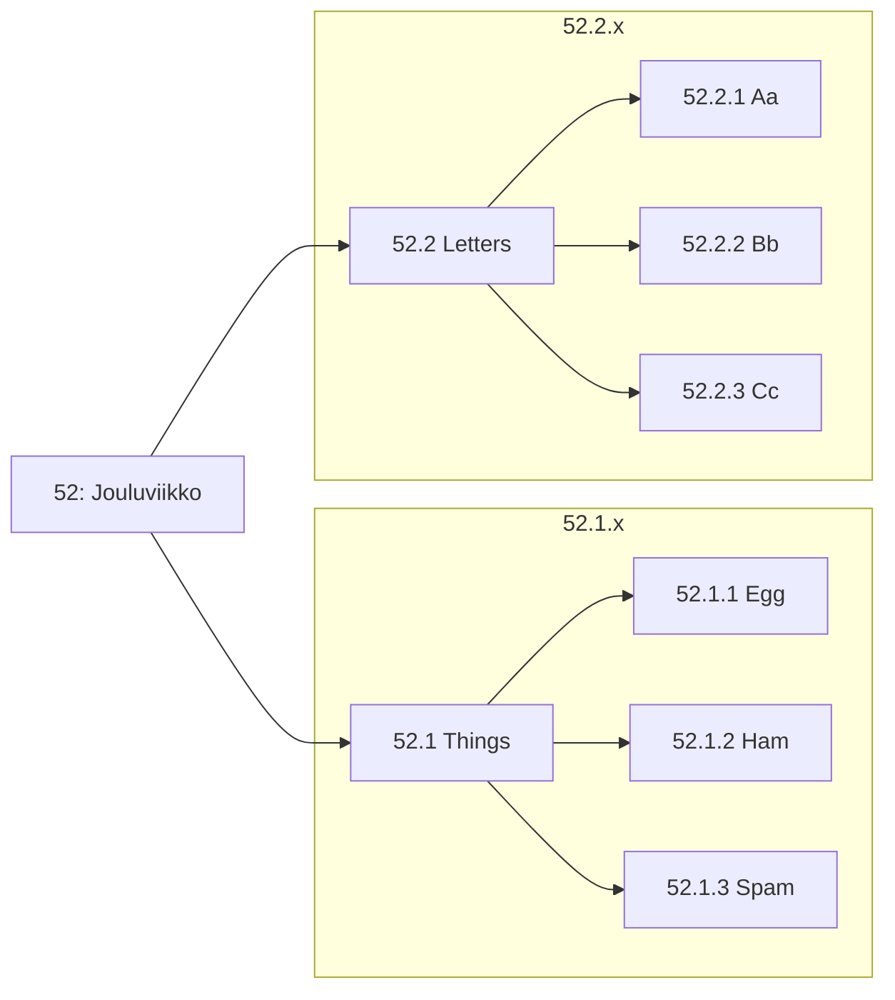

# 1: Oppimispäiväkirjan rakenne

## 1.1 Mikä on merkintä?

Oppimispäiväkirja koostuu useista eri **viikkotason** merkinnöistä. Tämä, mitä luet nyt, on kuvitellusti viikon 1 merkintä (eli kirjoitettu esimerkiksi 2. tammikuuta 2024). Tiedostona se löytyy lokaatiosta `docs/weeks/01_rakenne.md`. Kukin viikkotason merkintä on laajuudeltaan noin **1 liuskan eli 500 sanaa**. Voit ylittää tuon merkkirajan, mutta älä kirjoita yli kahta liuskaa eli noin 1000 merkkiä tekstiä. Valtaosan tekstistä tulisi koostua kokonaisista lauseista, jotka muodostavat kokonaisia kappaleita.
!!! tip

    Kuvien, graafien, listojen ja muiden runkotekstiä monimutkaisten elementtien käyttö on suositeltavaa. Käytä niitä kuitenkin harkiten. Käytä esimerkiksi kuvia silloin, kun teksti tarvitsee visuaalista tukea. Kuvien tulee tuoda jotakin lisäarvoa.

## 1.2 Usean tason otsikot

Tason kaksi otsikko tehdään Markdown:ssa kahdella `##` -merkillä. Kirjoita siis merkintäviikon otsikko muodossa `## {{vko}}: Lorem ipsum`, jossa `{{vko}}` edustaa viikonumeroa. Tämä ohje on kirjoitettu oletuksella, että työ on aloitetettu viikolla 1, mikä näkyy yllä olevasta pääotsikosta. Kirjoita oma oppimispäiväkirjasi siten, että otsikko edustaa sitä viikkonumeroa, milloin kirjoitat kyseistä merkintää. 

```markdown title="52_something.md"
## 52: Jouluviikko

Kirjoita tähän kyseisen oppimispäiväkirjan merkinnän runkoteksti.
Jos tarvitset alemman tason otsikoita, käytä niitä hierarkisesti. 
Otsikoita ei tule kylvää liiallisesti. Käytä niitä vain, jos pitkä 
viikkomerkintä on tarpeellista jakaa teemallisesti eri osiin.

Huomaa, että yksi rivivaihto ei riitä luomaan uutta kappaleenalkua.
```

Jos tarvitset alemman tason otsikoita, käytä niitä hierarkisesti. Tätä on kuvattu mermaid-kuvaajassa alla. Voit luoda omia mermaid-kuvaajia sinun omaan dokumentaatioosi [^1739a4]. Material for MkDocs -sivuston `Table of Contents` -osio, joka näkyy ruudun oikeassa laidassa, on hyvä apuväline otsikoiden hierarkisuuden tarkkailuun. Katso reilusti otsikoida sisältävästä [06_cookiecutter.md](06_cookiecutter.md) -tiedostosta esimerkkiä hierarkisesta otsikoinnista.



**Kuvio 1:** *Esimerkki sisäkkäisistä otsikoista. Ethän käydä tason n otsikkoa, jos se on ainut laatuaan. Kuvioille, kuville, kuvaajille tai muille visuaalisille elementeille on hyvä antaa kuvateksti. Rivi, jota luet juuri nyt, toimii esimerkkinä sellaisesta.*

Viikosta riippumattomia otsikoita ei tarvitse numeroita. Näitä ovat esimerkiksi `Itsearviointi` ja `Johdanto`.

## 1.3 Muut muotoilut

Voit käyttää kaikkia niitä Markdown-kielen ominaisuuksia, joita Material for MkDocs tukee, ja jotka sinä olet sivustolle aktivoinut [^115dd4]. Yksi näistä ovat **Footnote**:t, jotka mahdollistavat **Vancouver**-tyyliset lähdemerkinnät. Oppilaiden cookiecutter-templaatissa on vakiona aktivoituna Footnotes: katso tiedoston `mkdocs.yml` sisältö. Markdown-alaviitteitä tukee myös esimerkiksi Gitlab (GitLab Flavoured Markdown, GLFM) [^1739a4], kuten monet muutkin alustat ja sovellukset, jotka ymmärtävät Extended Markdownia [^e2a436]. Huomaa, että oppimispäiväkirjan rakenne on yksi arvosteteluperusteista. Tee se huolella. Alla joitakin vinkkejä listamuodossa:

* Käytä luetelmaa [^d1a7a7] kun listaat asioita.
    * Tämä, mitä luet nyt, on luetelma.
* Käytä koodilohkoja, kun kirjoitat koodia.

    ```python
    # Tämä on koodilohko
    print("Olen koodilohko!")
    ```
* Käytä yksinkertaisiin kuvaajiin mermaidia.
* Käytä kuvia, kun haluat näyttää jotain visuaalista.
    * Kuvaajia voit luoda esimerkiksi [excalidraw](https://excalidraw.com/) -sivustolla.
    * Muistathan tarkistaa netistä löytämiesi kuvien tekijänoikeudet!

Ethän laita koodia kuvina! Käydä tähän koodilohkoja. Koodilohko luodaan asettamalla koodi kolmen backtickin tai tilden sisään. Koodilohkon aloittavan blokin perään tulee kirjoitettaa käytetyn koodin kieli, jotta syntaksin värikorostuvat toimivat oikein. MarkDown-tiedostossa Python-lohko näyttäisi siis tältä:

~~~markdown
```python
# Backtick: SHIFT + ´ (the button on the left of BACKSPACE)
markdown = "Easy"
```
~~~

## Lähdeluettelo

[^115dd4]: Material for MkDocs. *Reference*. https://squidfunk.github.io/mkdocs-material/reference/
[^1739a4]: GitLab Docs. *GitLab Flavored Markdown (GLFM)*. https://docs.gitlab.com/ee/user/markdown.html
[^e2a436]: Markdown Guide. *Extended Syntax*. https://www.markdownguide.org/extended-syntax/
[^d1a7a7]: Kielitoimiston ohjepankki. *Luetelma*. https://kielitoimistonohjepankki.fi/ohje/luetelma/