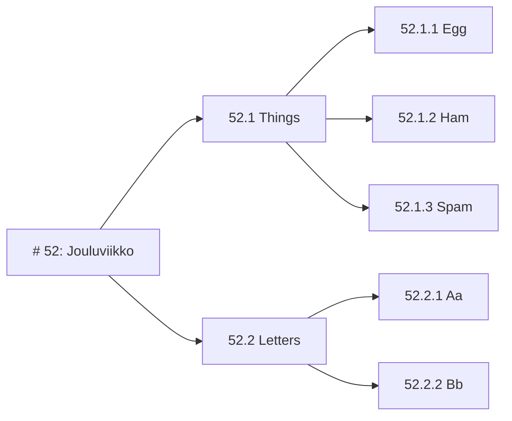

# 1: Oppimispäiväkirjan rakenne

Oppimispäiväkirja koostuu useista eri **viikkotason** merkinnöistä, ja kukin niistä on toisen tason otsikko. Kukin viikkotason merkintä on laajuudeltaan noin **1 liuskan eli 500 sanaa**. Voit ylittää tuon merkkirajan, mutta älä kirjoita yli kahta liuskaa eli noin 1000 merkkiä tekstiä. Kuvia ei lasketa merkkimäärään mukaan; käytä niitä silloin, kun teksti tarvitsee visuaalista tukea.

Tason kaksi otsikko tehdään Markdown:ssa kahdella `##` -merkillä. Kirjoita siis merkintäviikon otsikko muodossa `## {{vko}}: Lorem ipsum`, jossa `{{vko}}` edustaa viikonumeroa. Tämä ohje on kirjoitettu oletuksella, että työ on aloitetettu viikolla 1, mikä näkyy yllä olevasta otsikosta. Kirjoita oma oppimispäiväkirjasi siten, että otsikko edustaa sitä viikkonumeroa, milloin kirjoitat kyseistä merkintää. Valtaosan tekstistä tulisi koostua kokonaisista lauseista, jotka muodostavat kokonaisia kappaleita.

```markdown
## 52: Jouluviikko

Tähän kirjoitat kyseisen oppimispäiväkirjan merkinnän runkoteksti. Jos tarvitset alemman tason otsikoita, käytä niitä hierarkisesti. Otsikoita ei tule kylvää liiallisesti. Käytä niitä vain, jos pitkä viikkomerkintä on tarpeellista jakaa teemallisesti eri osiin.
```

Jos tarvitset alempia otsikoita, käytä niitä hierarkisesti. Tätä on kuvattu mermaid-kuvaajassa alla. Voit luoda omia mermaid-kuvaajia sinun omaan dokumentaatioosi [^1739a4].



**Kuvio 1:** *Esimerkki sisäkkäisistä otsikoista. Ethän käydä tason n otsikkoa, jos se on ainut laatuaan. Kuvioille, kuville, kuvaajille tai muille visuaalisille elementeille on hyvä antaa kuvateksti. Tämä toimii esimerkkinä sellaisesta.*

Huomaa, että viikkoihin sidotut otsikot ovat numeroituja, mutta viikosta riippumattomat otsikot eivät ole. Näitä ovat esimerkiksi `Itsearviointi` ja `Lähdeluettelo`.

Käytä Extended Markdown-kielen Gitlab-murretta. Tämä sallii joitakin ominaisuuksia, joita ei tyypillisessä Markdownissa ole. Yksi näistä ovat **Footnote**:t, jotka mahdollistavat **Vancouver**-tyyliset lähdemerkinnät [^1739a4]. Footnoteja eli suomeksi alaviitteitä tukevat myös muut alustat ja sovellukset, jotka ymmärtävät Extended Markdownia [^e2a436]. Huomaa, että oppimispäiväkirjan rakenne on yksi arvosteteluperusteista. Tee se huolella. Alla joitakin vinkkejä listamuodossa:

* Käytä luetelmaa [^d1a7a7] kun listaat asioita.
* Käytä koodilohkoja, kun kirjoitat koodia.
* Käytä yksinkertaisiin kuvaajiin mermaidia.
* Käytä kuvia, kun haluat näyttää jotain visuaalista.
    * Kuvaajia voit luoda esimerkiksi [excalidraw](https://excalidraw.com/) -sivustolla.
    * Muistathan tarkistaa netistä löytämiesi kuvien tekijänoikeudet!

Ethän kuitenkaan laita koodia kuvina! Käydä tähän koodilohkoja. Koodilohko luodaan asettamalla koodi kolmen backtickin tai tilden sisään. Koodilohkon aloittavan blokin perään tulee kirjoitettaa käytetyn koodin kieli, jotta syntaksin värikorostuvat toimivat oikein. MarkDown-tiedostossa Python-lohko näyttäisi siis tältä:

~~~markdown
```python
# Backtick: SHIFT + ´ (the button on the left of BACKSPACE)
md = "Easy"
```
~~~

## Lähdeluettelo

[^1739a4]: GitLab Docs. *GitLab Flavored Markdown (GLFM)*. https://docs.gitlab.com/ee/user/markdown.html
[^e2a436]: Markdown Guide. *Extended Syntax*. https://www.markdownguide.org/extended-syntax/
[^d1a7a7]: Kielitoimiston ohjepankki. *Luetelma*. https://kielitoimistonohjepankki.fi/ohje/luetelma/