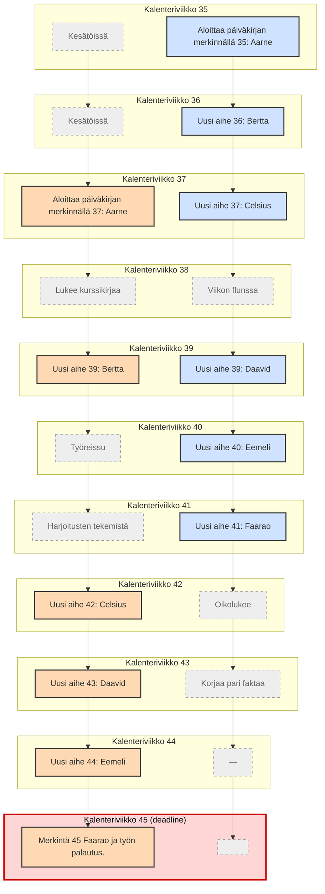

# 1: Oppimispäiväkirjan rakenne

## Mikä on oppimispäiväkirja?

Jos suoritat kurssia, jonka oppimispäiväkirjan sisältö on määritelty Oppimispäiväkirja 101 -spesifikaation mukaiseksi, sinun tulee noudattaa tätä ohjetta. Älä keksi määritelmiä itse tai kysy niitä ChatGPT:ltä.

> "Oppimispäiväkirja pyrkii olemaan kokonaisuus, jossa opintojaksolla opitun avulla pystyt laventamaan aiempaa osaamistasi tai muuttamaan omaa ajattelutapaasi. Merkittävintä tekstissä ovat opintojaksolla esitetyt, sinulle tärkeät käsitteet tai teoriat, joiden olet huomannut muuttaneen ajatteluasi tai asenteitasi."
>
> — Hanna Vilkka [^akateemisen]

Hanna Vilkkan määritelmiin nojaten kyseessä Oppimispäiväkirja 101:n määrittelemä formaatti on välimalli termeistä oppimispäiväkirja ja luentopäiväkirja [^akateemisen]. Jos pohdit, miksi sinä ylipäätänsä joudut kirjoittamaan aiheesta etkä vain tekemään esimerkiksi toimivaa ohjelmaa, niin lue tästä aiheesta lisää sivulta [Miksi oppimispäiväkirja](03_miksi.md). Tämän otsikon alla käsitellään tekstiä lähinnä määrällisestä ja muodollisesta näkökulmasta. Laadullinen ja tyylillinen näkökulma käsitellään [Akateeminen tyyli](04_tyyli.md)-sivulla. On äärimmäisen suositeltavaa, että luet koko Oppimispäiväkirja 101 ohjeen aivan alusta loppuun ajatuksella. Tee tarpeen mukaan myös itsellesi muistiinpanoja.

## Teemamerkintä

### Määritelmä

Oppimispäiväkirjan yksittäinen ==teemamerkintä== on **kokemukseen ja teoriaan nojautuva asiateksti kyseisen viikon teemasta**. Termi on opettajan keksintö. Alla joitakin harkittuja termejä:

* ⛔ **Raportti**: Pyrkii liialliseen objektiivisuuteen. Ei sovellu osaksi oppimispäiväkirjaa.
* ⛔ **Essee**: Meiltä puuttuu selkeä väite tai näkökulma, jota argumentoida. [^akateemisen]
* ⛔ **Luentopäiväkirja**: Tämä on lähellä. Luentopäiväkirjan voi kirjoittaa monella tapaa, ja eräs *"tapa on, että käsittelet jokaista luentoa erikseen."* [^akateemisen]
* ✅ **Teemamerkintä:** Keksitty sana, joka tarkoittaa yllä mainittua *erästä tapaa* kirjoittaa oppimis/luentopäiväkirja.

Kirjoittamamme ==kokonaisuus on siis oppimispäiväkirja== tai *luentopäiväkirja*, mutta yksittäinen merkintä on nimeltään teemamerkintä. Jos kurssilla on 9 teemaa, sinun oppimispäiväkirjassasi on 9 teemamerkintää. Kukin teemamerkintä käsittelee yhtä kurssin teemaa. Nämä teemat listataan kurssin ohjeistuksessa – yleensä Reppu-palvelin Aloita tästä -osiossa. Teemojen määrä vaihtelee kursseittain. Esimerkiksi kurssin [Syväoppiminen I](https://sourander.github.io/syvaoppiminen/) sisällysluettelossa on 8 teemaa, ja ne ovat:

```plaintext
Syväoppiminen I
  Johdanto
  1. Neuroverkot
  2. Tensorit
     ...
  7. Kieli
  8. Aikasarjat
  Tehtäväkoste
```

Mikäli osallistuisit kurssille Syväoppiminen I, kirjoittaisit 8 merkintää. Mikäli aloittaisit kurssin viikolla 12, ensimmäisen merkintäsi otsikko olisi `12: Neuroverkot` tai `12: Yleistä neuroverkoista` tai `12: Ensikosketus syväoppimiseen`. Tarkka otsikko on sinun valintasi, mutta teema on päätetty puolestasi!

!!! warning

    Et voi siis palauttaa yhtä pitkää `README.md`-tiedostoa, joka käsittelee kaikkia luentoja. Et voi myöskään palauttaa kymmeniä tai satoja lyhyitä Markdown-tiedostoja, jotka ovat hajautettu sinne tänne. Jos sinulla on esimerkiksi terveydellinen syy vaihtoehtoiseen suoritustapaan, älä sooloile ja tee oletuksia, vaan ota yhteyttä opettajaan ja sovi asiasta etukäteen.

### Merkintöjen ajoitus kalenterissa

Monilla opiskelijoilla on hyvä syy opiskella omaan tahtiinsa. Tämä on sallittua, annettuna että noudatat edellä esiteltyjä sääntöjä. On oletus, että etenet kurssin teemoja järjestyksessä alusta loppuun: aiemmat teemat rakentavat pohjan myöhemmille teemoille. On myös oletus, että kunkin merkinnän otsikosta selviää, ==millä viikolla olet aloittanut== kyseisen merkinnän kirjoittamisen.

Tämä viikoittainen eteneminen on esitetty alla Mermaid-kuvaajassa. Olkoon kaksi opiskelijaa: oranssi (:orange_square:) ja sininen (:blue_square:). He osallistuvat kurssille syyslukukaudella. Teemoja on kuusi kappaletta, ja ne ovat: **Aarne**, **Bertta**, **Celcius**, **Daavid**, **Eemeli** ja **Faarao**. Kurssin aloitusluento on viikolla 35 ja deadline on tässä tapauksessa viikolla 45. Oranssi (:orange_square:) aloittaa syyslukukauden hieman myöhässä kesätöiden takia. Sen sijaan sininen (:blue_square:) aloittaa kurssin teemojen käsittelyn heti aloitusluennon päivänä.


```mermaid
flowchart TB

    subgraph v35["Kalenteriviikko 35"]
        a35["Kesätöissä"]
        b35["Aloittaa päiväkirjan merkinnällä 35: Aarne"]
    end

    subgraph v36["Kalenteriviikko 36"]
        a36["Kesätöissä"]
        b36["Uusi aihe 36: Bertta"]
    end

    subgraph v37["Kalenteriviikko 37"]
        a37["Aloittaa päiväkirjan merkinnällä 37: Aarne"]
        b37["Uusi aihe 37: Celsius"]
    end

    subgraph v38["Kalenteriviikko 38"]
        a38["Lukee kurssikirjaa"]
        b38["Viikon flunssa"]
    end

    subgraph v39["Kalenteriviikko 39"]
        a39["Uusi aihe 39: Bertta"]
        b39["Uusi aihe 39: Daavid"]
    end

    subgraph v40["Kalenteriviikko 40"]
        a40["Työreissu"]
        b40["Uusi aihe 40: Eemeli"]
    end

    subgraph v41["Kalenteriviikko 41"]
        a41["Harjoitusten tekemistä"]
        b41["Uusi aihe 41: Faarao"]
    end

    subgraph v42["Kalenteriviikko 42"]
        a42["Uusi aihe 42: Celsius"]
        b42["Oikolukee"]
    end

    subgraph v43["Kalenteriviikko 43"]
        a43["Uusi aihe 43: Daavid"]
        b43["Korjaa pari faktaa"]
    end

    subgraph v44["Kalenteriviikko 44"]
        a44["Uusi aihe 44: Eemeli"]
        b44["—"]
    end

    subgraph v45["Kalenteriviikko 45 (deadline)"]
        a45["Merkintä 45 Faarao ja työn palautus."]
        b45[" "]
    end


    classDef studentA fill:#FFD9B3,stroke:#333,stroke-width:2px;
    classDef studentB fill:#CFE2FF,stroke:#333,stroke-width:2px;
    classDef deadline fill:#FFD6D6,stroke:#CC0000,stroke-width:3px,color:#000;
    classDef slacking fill:#eeeeee,stroke:#999,stroke-dasharray: 5 5,color:#666;

    class a37,a39,a42,a43,a44,a45 studentA;
    class a35,a36,a38,a40,a41 slacking;
    class b35,b36,b37,b39,b40,b41 studentB;
    class b38,b42,b43,b44,b45 slacking;
    class v45 deadline;

    a35 --> a36 --> a37 --> a38 --> a39 --> a40 --> a41 --> a42 --> a43 --> a44 --> a45
    b35 --> b36 --> b37 --> b38 --> b39 --> b40 --> b41 --> b42 --> b43 --> b44 --> b45
```

Kumpikin opiskelija – oranssi (:orange_square:) ja sininen (:blue_square:) – ovat työskennelleen eri syistä eri tahtiin. Kumpikin on kuitenkin tuottanut merkinnän jokaiseen viikkoteemaan. Kumpikin opiskelija voi saada täyden arvosanan (5/5) kurssista. Jos joku opiskelija palauttaisi työn myöhässä ==ilman että asiasta on sovittu etukäteen opettajan kanssa==, tämä vaikuttaa negatiivisesti arvosanaan. Kurssikohtainen myöhästymisrangaistus on määritetty kurssitoteutuksen virallisessa kuvauksessa, mutta yleensä se on: arvosanan maksimi laskee 3/5:een.

!!! tip "Nopeampi tai hitaampi suoritus"

    **Nopeampi suoritus 🏎️:** Jos olet jo etukäteen kurssin aihepiirien kanssa sinut, saatat kyetä kirjoittaa oppimispäiväkirjaa nopeammin kuin alunperin on tarkoitus. Noudata silti aitoa viikkonumerointia! Tämä luonnollisesti rikkoo sivujen numeroihintiin perustuvan aakkosjärjestyksen. Ratkaisu on käsin määritelty navigaatio. Kysy opettajalta neuvoa!

    **Hitaampi suoritus 🐌:** Joissain tapauksissa, kuten sairastumisen johdosta, sinulle saatetaan myöntää lisäaikaa eli työskentelet hitaammin kuin kurssin alkuperäinen aikataulu – eli siis sinulle annetaan uusi deadline. Noudata tällöinkin aitoja viikkonumeroita.

### Merkinnät Git Logissa

Kurssin [Arviointityökalu](https://arviointi.munpaas.com/) listaa yhtenä kriteerinä *opiskeluaktiivisuus*. Täyteen arvosanaan täytyy täyttyä ehdon, joka on 2026-03-23 noudettuna tiivistetysti: *"Opiskelija on ollut erittäin aktiivinen ja git-lokit ovat selkeät ja kattavat."* Aktiivisuutta voi *täydentää* Teams ja Discord-aktiivisuudella, kuten auttamalla muita opiskelijoita sekä osallistumalla yhteisten sessioiden keskusteluun, mutta Git-lokit ovat pakollinen elementti. Kuinka tämä tarkastetaan? Opettaja ajaa esimerkiksi seuraavia komentoja:

```bash
git clone <repository-url>
git log --pretty=format:"%x09%ad%x09%s" --date=format:"%V %a"
```

Tästä tulostuu lista, kuten:

```
    45 ke    Korjattu lähdeviittauksien järjestys oat toolilla
    45 ke    Faarao viimeistelty
    45 ti    Viimeistelty itsearviointi
    45 ke    Merkintä 45 Faarao luonnos
    45 ma    Tarkistettu kieliasu

    44 pe    Merkintä 44 Eemeli aloitettu
    44 to    Korjattu lähdeviittauksien järjestys oat toolilla
    44 ke    Poistettu omat muistiinpanot

    .. ..    ...

    38 pe    Suhteellisuusteorian määritelmä korjattu Aku Ankan faktoilla
    38 to    Lisätty määritelmiä
    38 ti    Jäsennelty Aarne-merkintää

    37 pe    Aarne-merkinnän ensimmäinen versio
    37 ke    Merkintä 37 Aarne aloitettu
```

Tuon listan tulee edustaa sitä todellisuutta, mikä eri commiteissa näkyy. Lasken eri committien tuomaa muutosta tiedostojen merkkimääriin skriptin avulla. Lisäksi teen manuaalista tarkastelua. Jos ajan esimerkiksi seuraavat komennot, niin näen oppimispäiväkirjasi siinä tilassa, missä se oli viikon 38 tiistaina:

```bash
COMMIT_HASH=$(git log --grep="Jäsennelty Aarne-merkintää" --format="%H" -n 1)
git checkout $COMMIT_HASH
```

!!! warning

    Historiasta paljastuva täyteteksti tai muu palautuksen huijaus tulkitaan vilppinä. Vilppiä käsitellään KAMK:n prosessien mukaisesti. Vilppi voi johtaa esimerkiksi kyseisen kriteerin putoamiseen `0/5`:een, kurssisuorituksen hylkäämiseen tai toistuvien vilppitapausten johdosta vakavampiin seuraamuksiin.

## Merkinnän sisältö

### Rakenne

Teemamerkintä käsittelee kyseisen viikon aihetta. Suuntaa-antava rakenne yksittäiselle merkinnälle on:

| Osa                    | Mitä tähän kuuluu?                  | Ohjaavia kysymyksiä / sisältöä                                                                                            | Arvio sanamäärästä |
| ---------------------- | ----------------------------------- | ------------------------------------------------------------------------------------------------------------------------- | -----------------: |
| **Otsikko**            | Viikkonumero + aiheen nimi          | Esim. *39: Poolon etiketti*                                                                                               |                2–5 |
| **Johdanto**           | Lyhyt alustus aiheeseen             | Mitä aihetta käsitellään? Miksi aihe on tärkeä kurssin kannalta?                                                          |            100–150 |
| **Määritelmät**        | Keskeiset käsitteet ja ilmiöt       | Miten määrittelet aiheen tärkeimmät termit? Voit käyttää taulukoita, kuvaajia, lainauksia jne.                            |            150–200 |
| **Käsittelyosa**       | Merkinnän varsinainen pääosa        | Mitä teit, mitä opit, mitä oivalsit? Käytä kuvia, kaavioita, koodilohkoja, listoja, taulukoita, lainauksia, linkkejä jne. |            300–600 |
| **(Lyhyt) Yhteenveto** | Tiivistys tärkeimmistä havainnoista | Mitä jäi erityisesti mieleen? Mihin tutustut vielä jatkossa?                                                              |             80–120 |
| **Lähdeluettelo**      | Käytetyt lähteet                    | Kirjat, artikkelit, verkkosivut, kurssimateriaalit jne.                                                                   |         ei lasketa |

Huomaa, että tämä on vain esimerkki rakenteesta. Rakenteen osioiden ei tarvitse olla otsikoituja vaan ne voivat sulautua toisiinsa tekstikappaleina. Lisäksi, jos aihe on täysin teoreettinen (esim. Tekoälyn etiikka), käsittelyosa ja määritelmät sulautuvat herkästi yhteen. Useimmiten aihe on kuitenkin vahvasti käytännönlähtöinen.

!!! warning "Tärkeää"

    Etsin oppimispäiväkirjastasi **todisteita siitä, että sinä osaat ja ymmärrät** kurssin aihepiirin asiat. Oppimispäiväkirja ei voi olla pelkkä lista faktoja, ChatGPT:n tuottama teksti tai kasa suoria lainauksia jostakin kirjasta. Oppimispäiväkirja on **sinun** työsi, jossa **sinä** osoitat osaamisesi.

    * Kerro, **kuinka** olet työskennellyt ja mitä olet tehnyt.
    * Lisää **omia ajatuksiasi** eli niitä oivalluksia, joita olet kurssin aikana saanut.
    * Lisää **kuvakaappauksia**, joista käy ilmiselväksi, että sinä olet työskennellyt tehtävien parissa.

### Kuvien käyttö

Kuvien, graafien, listojen, koodilohkojen ja muiden runkotekstiä monimutkaisten elementtien käyttö on  ==pakollista==. Ethän palauta esseetekstiä, jossa tekoälyn generoima teksti kuvailee aihetta yleisluonteisesti. Käytä kuvia ja muita elementtejä osoittaaksesi, että olet työskennellyt kurssin aihepiirin parissa.

Käytä kuvia ja kuvaajia kuitenkin harkiten. Leipätekstin tulee rytmittää päiväkirjamerkintää ja pitää lukija perillä siitä, mihin kuvat liittyvät. Päiväkirjan pohjana on siis kokonaisia virkkeitä, jotka muodostavat kokonaisia kappaleita. Päiväkirja ei voi olla pelkkä kuvagalleria tai luettelo asioita.

### Merkinnän laajuus

Päiväkirjamerkinnöillä ei ole maksimipituutta, mutta älä odota, että määrä korvaa laadun. Mikäli teksti meinaa rönsyillä, tiivistä ja keskity olennaiseen. Kuka tahansa osaa kirjoittaa pitkästi; tiivisti kirjoittaminen vaatii harjoitusta. Tähän liittyen on edellä lainaus:

!!! quote

    "I would have written a shorter letter, but I did not have the time."

    — Blaise Pascal [^npr]

Vaihtoehtoisesti voit aluksi kirjoittaa aluksi vapaamuotoisemman, pidemmän oppimispäiväkirjan, ja editoida sen palautusviikolla sopivaan mittaan. Tällöin teet tärkeitä valintoja siitä, mikä on olennaista, mikä ei. Tämä on tärkeä taito opinnäytetyötä ja työelämääkin ajatellen.

Varmista kuitenkin, että kukin teemamerkintä on laajuudeltaan aivan vähimmillään noin **1 liuskan eli 500 sanaa**.  On täysin realistista, että voit saavuttaa täyden arvosanan (5/5) noin 500 sanalla. On totta, että 500 sanaa on suppea määrä sanoja prosessien kuvaamiseen, mutta ota huomioon, että tähän ei lasketa kuvia ja koodilohkoja; niiden tehokas käyttö on oiva tapa sisällyttää paljon tietoa lyhyeen tekstiin.

!!! tip "Sanamäärän laskeminen (oat-tools)"

    Voit laskea Markdown-tiedoston sanojen määrän käyttämällä `oat-tools`-työkalua. Olettaen että sinulla on [astral-sh/uv](https://docs.astral.sh/uv) asennettuna, voit asentaa `oat-tools`:n näin:

    ```bash
    uv tool install oat-tools
    ```

    Tämän jälkeen voit laskea sanojen määrän komennolla `oat wordcount path/to/file.md`. Työkalu jättää laskematta esimerkiksi koodilohkoissa olevat sanat, joten se on hyvä tapa laskea vain runkotekstin sanat. Alla olevan komennon avulla voit laskea **kaikkien** oppimispäiväkirjan Markdown-tiedostojen sanojen määrän kerralla:

    ```console
    $ oat wordcount docs/**/*.md
    File                           Word Count
    ---------------------------  ------------
    docs/docs/index.md                    252
    docs/docs/itsearviointi.md            340
    docs/docs/weeks/35_entry.md           580
    docs/docs/weeks/36_entry.md           635
    docs/docs/weeks/37_entry.md           554
    docs/docs/weeks/38_entry.md           622
    docs/docs/weeks/39_entry.md           534
    docs/docs/weeks/40_entry.md           602
    ```

    Tämä komento pyrkii laskemaan vain leipätekstin sanat: koodilohkot jätetään laskematta. Menetelmä ei ole kuitenkaan aivan vedenpitävä. Esimerkiksi taulukot voivat vaikuttaa sanamäärään. Tarkemmat käyttöohjeet löydät [oat-tools](https://pypi.org/project/oat-tools/) -projektin sivulta.

[^npr]: Lombrozo, T. *This Could Have Been Shorter*. NPR. https://www.npr.org/sections/13.7/2014/02/03/270680304/this-could-have-been-shorter
[^akateemisen]: Vilkka, H. *Akateemisen lukemisen ja kirjoittamisen opas.* Jyväskylä: PS-Kustannus. 2020.