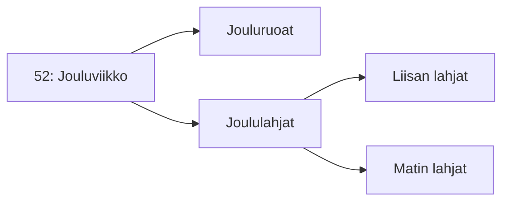

# 1: Oppimispäiväkirjan rakenne

## Mikä on merkintä?

Oppimispäiväkirja koostuu useista eri **viikkotason** merkinnöistä. ==Tämä==, mitä luet nyt, on kuvitellusti viikon 1 merkintä eli kirjoitettu esimerkiksi 2. tammikuuta 2024. Jos kurssi alkaa elokuussa, viikko voi olla esimerkiksi 31. Noudata kalenteriviikkoja. Tiedostona viikkomerkintä löytyy lokaatiosta `docs/weeks/01_rakenne.md`. Kukin viikkotason merkintä on laajuudeltaan noin **1 liuskan eli 500 sanaa**. Voit ylittää tuon rajan, mutta älä kirjoita yli kahta liuskaa eli noin 1000 sanaa tekstiä. Mikäli tekstiä meinaa syntyä liikaa, tiivistä ja keskity olennaiseen. Kuka tahansa osaa kirjoittaa pitkästi; tiivisti kirjoittaminen vaatii harjoitusta.

!!! tip

    Kuvien, graafien, listojen, koodilohkojen ja muiden runkotekstiä monimutkaisten elementtien käyttö on suositeltavaa. Käytä niitä kuitenkin harkiten. Käytä esimerkiksi kuvia silloin, kun teksti tarvitsee visuaalista tukea. Kuvien tulee tuoda jotakin lisäarvoa. Valtaosan päiväkirjamerkinnästä tulisi koostua kokonaisista lauseista, jotka muodostavat kokonaisia kappaleita. Päiväkirja ei siis voi olla pelkkä kuvagalleria tai luettelo asioita.

## Usean tason otsikot

Otsikko tehdään Markdown:ssa aloittamalla rivi yhdellä tai useammalla `#`-merkillä. Päätason otsikossa on yksi `#`-merkki, tason 2 otsikossa on `##`, ja niin edelleen. Tämä oat-ohje on kirjoitettu oletuksella, että työ on aloitetettu viikolla 1 - siksi tämä luku (Oppimispäiväkirjan rakenne) on nimenomaan luku 1. Aloita oma päiväkirjasi siitä viikosta, jolta kurssi alkaa. Myöhemmin esiteltävä ==Cookiecutter-työkalu tekee tämän automaattisesti== siten, että ensimmäinen tiedosto saa numeronsa automaattisesti siitä ajanhetkestä, milloin projektin aloitat.

!!! warning

    Vakiona Material for MkDocs ottaa tiedoston nimen ja muovaa siitä otsikon. Tämän ==tämä== dokumentti, eli `01_rakenne.md`, ei sisältäisi käsin muokattua otsikkoa (`# 1: Oppimispäiväkirjan rakenne`), sen otsikko olisi rumasti `01 rakenne`.

    Kirjoita siis myös kattotason otsikko kullekin päiväkirjamerkinnälle! Sen tulee alkaa viikkonumerolla ja kaksoispisteellä.

Alla vielä selvyyden vuoksi raakaa Markdown-syntaksi sisältävä koodilohko, jossa on leikisti jouluviikolla kirjoitettu merkintä. Muita otsikoita ei ole pakko numeroida.

```markdown title="52_something.md"
# 52: Jouluviikko

Kirjoita tähän kyseisen oppimispäiväkirjan merkinnän runkoteksti.
Jos tarvitset alemman tason otsikoita, käytä niitä hierarkisesti. 
Otsikoita ei tule kylvää liiallisesti. Käytä niitä vain, jos pitkä 
viikkomerkintä on tarpeellista jakaa teemallisesti eri osiin.

Huomaa, että yksi rivivaihto ei riitä luomaan uutta kappaleenalkua.

## Jouluruoat

[Tähän sisältöä jouluruoista yleisellä tasolla]

## Joululahjat

[Tähän sisältöä joululahjoista yleisellä tasolla]

### Liisan lahjat

[Tähän sisältöä Liisan lahjoista]

### Matin lahjat

[Tähän sisältöä Matin lahjoista]
```

Material for MkDocs -sivuston `Table of Contents` -osio, joka näkyy ruudun oikeassa laidassa, on hyvä apuväline otsikoiden hierarkisuuden tarkkailuun. Katso reilusti otsikoida sisältävästä [06_cookiecutter.md](06_cookiecutter.md) -tiedostosta esimerkkiä hierarkisesta otsikoinnista. Alla on esimerkki mermaid-graafista, joka kuvaa sisäkkäisiä otsikoita. Voit käyttää omassa oppimispäiväkirjassasi mermaidia, jos se on asetettu aktiiviseksi. Tämä selviää `mkdocs.yml` -tiedostosta. Mikäli tarvitset tähän ohjeita, luota Material for MkDocs:n dokumentaatioon [^115dd4].



**Kuvio 1:** *Esimerkki sisäkkäisistä otsikoista. Ethän käydä tason n otsikkoa, jos se on ainut laatuaan. Kuvioille, kuville, kuvaajille tai muille visuaalisille elementeille on hyvä antaa kuvateksti. Rivi, jota luet juuri nyt, toimii esimerkkinä sellaisesta.*

Viikosta riippumattomia päiväkirjamerkintöjä ei tarvitse numeroita. Näitä ovat esimerkiksi `Itsearviointi` ja `Johdanto`.

## Muut muotoilut

Voit käyttää kaikkia niitä Markdown-kielen ominaisuuksia, joita Material for MkDocs tukee, ja jotka sinä olet sivustolle aktivoinut [^115dd4]. Yksi ominaisuuksista on **Footnote**, joka mahdollistaa **Vancouver**-tyyliset lähdemerkinnät. Oppilaiden cookiecutter-templaatissa on vakiona aktivoituna tämä ominaisuus: katso tiedoston `mkdocs.yml` sisältö. Markdown-alaviitteitä tukee myös esimerkiksi Gitlab (GitLab Flavoured Markdown, GLFM) [^1739a4], kuten monet muutkin alustat ja sovellukset, jotka ymmärtävät Extended Markdownia [^e2a436]. Huomaa, että oppimispäiväkirjan rakenne on yksi arvosteluperusteista. Tee se huolella. Alla joitakin vinkkejä listamuodossa:

* Käytä luetelmaa [^d1a7a7] kun listaat asioita.
    * Tämä, mitä luet nyt, on luetelma.
* Käytä koodilohkoja, kun kirjoitat koodia.

    ```python
    # Tämä on koodilohko
    print("Olen koodilohko!")
    ```

* Käytä yksinkertaisiin kuvaajiin mermaidia.
* Käytä monimutkaisiin kuvaajiin PNG- tai SVG-kuvia.
    * Kuvaajia voit luoda esimerkiksi [excalidraw](https://excalidraw.com/) -sivustolla.
* Käytä kuvakaappauksia tai muita kuvia harkiten.
    * Rajaa kuvaa. Kuvassa on vain olennainen eikä koko työpöytää.
    * Pienennä kuvat. Älä lataa useiden megapikseleiden kuvia gittiin.
    * Noudata tekijänoikeuksia!

Kun esittelet koodia, tee kuten yllä olevassa luettelossa neuvotaan, eli ==suosi koodilohkoja==. Koodilohko luodaan asettamalla koodi kolmen backtickin (tai joskus harvoin kolmen tilden sisään.) Backtick luodaan painamalla ++shift+"`"++ näppäimiä, joista jälkimmäinen löytyy tyypillisesti ++backspace++ -näppäimen eli askelpalauttimen vasemmalta puolelta. Koodilohkon aloittavan blokin perään tulee kirjoitettaa käytetyn koodin kieli, jotta syntaksin värikorostuvat toimivat oikein. MarkDown-tiedostossa Python-lohko näyttäisi siis tältä:

~~~markdown
 ┌─ Kolme backtickiä aloittavat koodilohkon
 │
┌┴┐

```python
import os

# Tämä on Python-syntaksissa kommentti
olen_muuttuja = "Olen muuttujaan sijoitettu literaali merkkijono."

# Minä olen Python print-funktion kutsu
print(olen_muuttuja)
```

└┬┘
 │
 └─ ... ja lopettavat koodilohkon.
~~~

## Lähdeluettelo

[^115dd4]: Material for MkDocs. *Reference*. https://squidfunk.github.io/mkdocs-material/reference/
[^1739a4]: GitLab Docs. *GitLab Flavored Markdown (GLFM)*. https://docs.gitlab.com/ee/user/markdown.html
[^e2a436]: Markdown Guide. *Extended Syntax*. https://www.markdownguide.org/extended-syntax/
[^d1a7a7]: Kielitoimiston ohjepankki. *Luetelma*. https://kielitoimistonohjepankki.fi/ohje/luetelma/