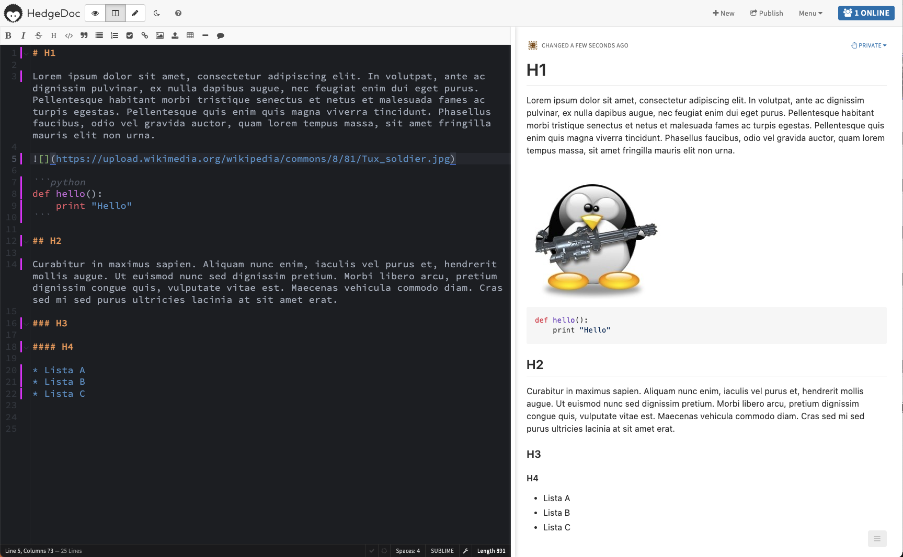
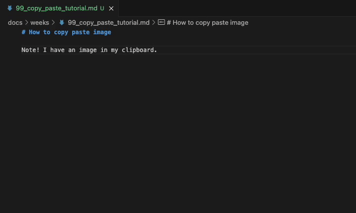
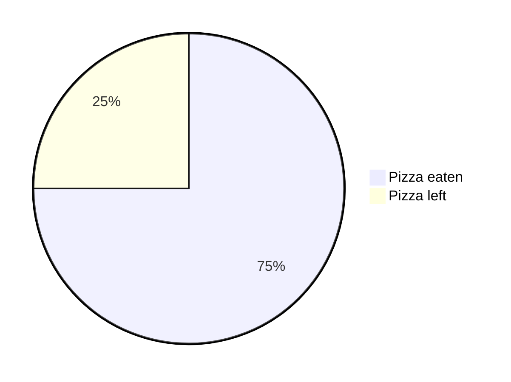

# 2: Markdown

!!! tip

    Jos Markdown-kielen syntaksi ja Material for MkDocs -teema ovat sinulle entuudestaan tuttua kauraa, voit siirtyä seuraavaan lukuun.

## Opiskele perusteet

Markdown-koodiin tutustumiseen on monta tapaa. Suosittelen tapaa, jossa käytät tätä ==juuri nyt lukemaasi== sivustoa apuna. Tämän koodi löytyy [gh:sourander/oat](http://www.github.com/sourander/oat) -repositoriosta. Toimi alla olevien vaiheiden mukaisesti:

### :one: Basic Syntax

Käy lukemassa [Markdown Guide: Basic Syntax](https://www.markdownguide.org/basic-syntax/).

* Silmäile [juuri tämän dokumentin](https://raw.githubusercontent.com/sourander/oat/refs/heads/main/docs/weeks/02_markdown.md) lähdekoodia.
* Etsi koodista Basic Syntax -linkin mukaisia elementtejä (otsikot, kappaleet, listat, lihavointi)
* Aloita oppimispäiväkirjasi ja käytä näitä perusmuotoiluita.


Jos haluat harjoitella interaktiivisesti, voit käyttää [DC-labra HedgeDog](https://gitlab.dclabra.fi/wiki/)-alustaa. Voit kirjautua palveluun DC GitLab -tunnuksilla. HedgeDogissa on mahdollista näkeä vierekkäin kirjoittamasi Markdown-syntaksi ja sen renderöity lopputulos.



**Kuva 1:** *HedgeDog-ympäristö. Tämä, mitä luet nyt, on kuvateksti. Kuvatekstin voi lisätä tavallisena kappaleena, jonka alku on lihavoituna kirjoitettuna `Kuva n:`*

### :two: Extended Syntax

Käy lukemassa [Markdown Guide: Extended Syntax](https://www.markdownguide.org/extended-syntax/).

* Etsi Oppimispäiväkirja 101:sta esimerkkejä Extended Syntax -elementeistä.
* Käytä niitä myös oppimispäiväkirjassasi.

### :three: Material for MkDocs

Tämä sivusto käyttää Material for MkDocs -teemaa (MkDocs:n päällä). Tutustu [Material for MkDocs: References](https://squidfunk.github.io/mkdocs-material/)-dokumentaatioon. Selvitä, mitä ainakin seuraavat ovat, ja kuinka niitä käytetään:

* admonitions
* data tables
* footnotes

Etsi Oppimispäiväkirja 101:sta esimerkkejä näistä elementeistä. Käytä niitä myös oppimispäiväkirjassasi.

!!! warning

    Huomaa, että nämä **eivät välttämättä toimi** HedgeDocissa tai esimerkiksi GitLabissa. Ne eivät kuulu tavalliseen Markdown-syntaksiin vaan ovat lisämausteita.

### :repeat: Testaa selaimella

Kun kirjoitat oppimispäiväkirjaa, aja Material for MkDocs -sivustoa lokaalisti. Tarkista, että sivusto renderöityy siten, kuten sen haluat renderöityvän. Jos ei, selvitä, mikä syntaksissa on pielessä: yleensä vika löytyy joko sisennyksestä tai puuttuvasta rivinvaihdosta. Palaa tarpeen mukaan aiemmin mainittujen ohjeiden pariin.

---

## Muotoiluvinkkejä

Voit käyttää kaikkia niitä Markdown-kielen ominaisuuksia, joita Material for MkDocs tukee, ja jotka sinä olet sivustolle aktivoinut [^115dd4] `mkdocs.yml` -tiedostossa. Yksi näistä ominaisuuksista on **Footnote**, joka mahdollistaa **Vancouver**-tyyliset lähdemerkinnät. Opiskelijoiden cookiecutter-templaatissa on vakiona aktivoituna tämä ominaisuus: katso tiedoston `mkdocs.yml` sisältö. Markdown-alaviitteitä tukee myös esimerkiksi Gitlab (GitLab Flavoured Markdown, GLFM) [^1739a4], kuten monet muutkin alustat ja sovellukset, jotka ymmärtävät Extended Markdownia [^e2a436]. Huomaa, että oppimispäiväkirjan rakenne on yksi arvosteluperusteista. Tee se huolella.

### :octicons-book-16: Otsikot

Material for MkDocs -sivuston `Table of Contents` -osio on hyvä apuväline otsikoiden hierarkisuuden tarkkailuun. Käytä otsikoita järkevästi. Liiallinen otsikointi hankaloittaa lukemista, mutta liian vähäinen otsikointi tekee tekstistä raskasta. Tasapaino on avain, ja tulevana asiantuntijana sinun tehtäväsi on etsiä tätä tasapainoa. Table of Contents löytyy tämän ikkunan oikeasta yläkulmasta. Löydät sen tuolta suunnasta :arrow_upper_right:

### :material-format-list-bulleted: Luetelmat

Käytä luetelmaa kun listaat asioita [^d1a7a7].

* Tämä
* On
* Luettelo

Ethän kirjoita kirjoita koko merkintää listamuodossa; korkeakouluopiskelijan tulee osata kirjoittaa kokonaisin lausein. Esimerkiksi pizzanteon vaiheet pääpiirteittäin ovat selkeä luettelo, mutta yksityiskohtaisten pizzanvalmistuksen vaiheiden avaaminen kuuluu leipätekstiin *(engl. body text)*.

### :octicons-code-square-16: Koodilohkot

Käytä koodilohkoja, kun kirjoitat koodia.

```python
# Tämä on koodilohko
print("Olen koodilohko!")
```

Koodilohko luodaan asettamalla koodi kolmen backtickin (tai joskus harvoin kolmen tilden sisään.) Backtick luodaan painamalla ++shift+"`"++ näppäimiä, joista jälkimmäinen löytyy tyypillisesti ++backspace++ -näppäimen eli askelpalauttimen vasemmalta puolelta. Koodilohkon aloittavan blokin perään tulee kirjoitettaa käytetyn koodin kieli, jotta syntaksin värikorostuvat toimivat oikein.

### :frame_photo: Kuvat

```markdown


**Kuva N:** *Kuvateksti kuvalle.*
```

Voit käyttää valokuvia tai kuvakaappauksia oppimispäiväkirjassasi. On suositeltavaa pienentää kuvia ennen niiden lataamista GitLabiin, mikäli kuvat ovat useita tuhansia pikseleitä kooltaan. Kuvan lisääminen hoituu yllä olevan koodisnippetin mukaisesti. Huomaa, että polku on relatiivinen.

#### Vinkki: Kuvatekstien numerointi

Kuvatekstien numerointi on ärsyttävää manuaalisesti. Voit käyttää apunasi opettajan luomaa `oat-tools`-työkalua:

```bash
uv tool install oat-tools

# Check safely
oat captions check docs/weeks/02_markdown.md

# Destructive fix
oat captions fix docs/weeks/02_markdown.md
```

!!! warning

    Älä koskaan aja yllä olevaa komentoa ilman, että olet tallentanut tiedostot ja mieluiten puskenut ne GitLabiin. Tee kuvatekstien numerointi mieluiten erilliseen committiin, jotta voit tarvittaessa perua muutokset helposti. 
    
    Komento muokkaa tiedostoa suoraan ja voi bugin tai odottamattoman syntaksin vuoksi sotkea tiedoston. Sinua on varoitettu. :skull:


#### Vinkki: Kuvan koon vaihtaminen

Kuvan kokoa voit vaihtaa helposti kuvankäsittelyohjelmalla, mutta mikäli olet Linuxissa, sinulla ei välttämättä ole graafista kuvankäsittelyohjelmaa asennettuna. Näin yksinkertaiseen tehtävään se olisi liioiteltu ohjelmisto muutenkin! Tämän tempun voi hoitaa komentoriviltä esimerkiksi `convert`-työkalulla, joka on osa ImageMagick-kirjastoa.

Kuvitellaan tilanne, että sinulla on älypuhelimella ottamasi kuva Raspberry Pi -laitteesta. Kuva on `4:3` kuvasuhteella ja kokoa `8064 × 6048` pikseliä eli hurjat 48 megapikseliä. Näin suurella kuvalla ei tee oppimispäiväkirjassa mitään, joten haluat pienentää kuvan siten, että ==pidempi sivu on vain 1024 pikseliä (kuvasuhteen muuttumatta)==. Lisähaasteena kuva on HEIC-formaatissa, jota useimmat selaimet eivät tue. Olet kopioinut kuvan Linux-koneellesi OneDrive tai Google Drive palvelusta hakemistoon `~/Code/kurssin-nimi-2099` ja tiedoston nimi on `IMG_1234.heic`.

```bash
# Asenna (jos ei ole jo)
sudo apt install imagemagick

# Mene hakemistoon, jossa kuva(t) ovat
cd ~/Code/kurssin-nimi-2099

# Kutsu imagemagickin convert-työkalua
convert IMG_1234.heic -resize 1024x1024 raspberry-pi-kammenella.jpg
```

Jatkossa kuva on enää maksimissaan 1 megapikselin kokoinen, joten oletettavasti tiedostokoko on pudonnut noin 1/48 osaan alkuperäisestä.

!!! tip

    Mikäli haluat muuttaa useamman kuvan kokoa kerralla, voit käyttää `mogrify`-komentoa:

    ```bash
    mogrify -resize 1024x1024 *.jpg
    ```

#### Vinkki: Kuvakaappauksen liittäminen

Mikäli olet liittämässä kuvakaappausta, kokeile Visual Studio Coden näppärää toimintoa, joka säästää sinulta aikaa. Sinun ei tarvitse käsin tallentaa kuvaa oikeaan hakemistoon ja kirjoittaa upotuskoodia itse; Visual Studio Code automatisoi tämän! Alla ohje sekä GIF-videona että tekstimuodossa.



**Video 1:** *Kuvan liittäminen leikepöydältä suoraan Markdown-dokumenttiin VS Codessa. Kuvatiedosto myös nimetään uusiksi. Lue samat vaiheet alta tekstimuodossa.*

* Ota kuvakaappaus
    * Win/Mac: ++print-screen++
    * macOS: ++cmd+shift+4++
* Liitä kuva Markdown-dokumenttiin (CTRL + v)
* VS Code:
    * Lisää kursorin kohdalle ``-kuvaupotuksen.
    * Luo tiedoston `image.png` samaan hakemistoon.
* Nimeä kuva vielä uusiksi:
    * Klikkaa kuvan polkua hiiren oikealla korvalla
        * Valitse: *Rename Symbol (F2)*
    * Kirjoita uusi nimi kuvalle.
    * VS Code nimeää kuvan uusiksi *(ja jopa siirtää toiseen hakemistoon, jos polku muuttuu)*.

!!! warning

    Yllä oleva kuvan liittäminen toimii myös muihin kuviin, jotka ovat leikepöydälläsi, kuten mihin tahansa internetistä kopioimaasi kuvaan. Huolehdithan, että ==sinulla on oikeudet käyttää kuvaa==. Älä koskaan väitä muiden ottamia kuvia tai tekemiä kuvaajia sinun sisällöksesi.

### :chart_with_upwards_trend: Kuvaajat



**Kuva 2:** *Kuvitteellinen jäljellä olevan ja syödyn pizzan suhdetta kuvastava piirakkakuvaaja. Kuville ja kuvaajille on hyvä lisätä kuvateksti. Tämä tässä toimii esimerkkinä.*

Todella yksinkertaisiin kuvaajiin voit käyttää mermaidia. Mermaid on helppo ja nopea tapa luoda yksinkertaisia kuvaajia [^mermaid]. Kyseisellä kielellä on tehty yllä näkyvä piirakkakuvaaja.

Monimutkaisempiin kuvaajiin voit käyttää PNG- tai SVG-kuvia. Käytä kuvia harkiten. Noudata tekijänoikeuksia ja käytä kuvia, jotka ovat vapaasti käytettävissäsi. Käytä kuvien luomiseen haluamasi ohjelmia tai web-sovelluksia. Yksi suositeltu web-sovellus on [excalidraw](https://excalidraw.com/).

## Lähdeluettelo

[^115dd4]: Material for MkDocs. *Reference*. https://squidfunk.github.io/mkdocs-material/reference/
[^1739a4]: GitLab Docs. *GitLab Flavored Markdown (GLFM)*. https://docs.gitlab.com/ee/user/markdown.html
[^e2a436]: Markdown Guide. *Extended Syntax*. https://www.markdownguide.org/extended-syntax/
[^d1a7a7]: Kielitoimiston ohjepankki. *Luetelma*. https://kielitoimistonohjepankki.fi/ohje/luetelma/
[^mermaid]: Mermaid. *Pie chart diagrams*. https://mermaid.js.org/syntax/pie.html
