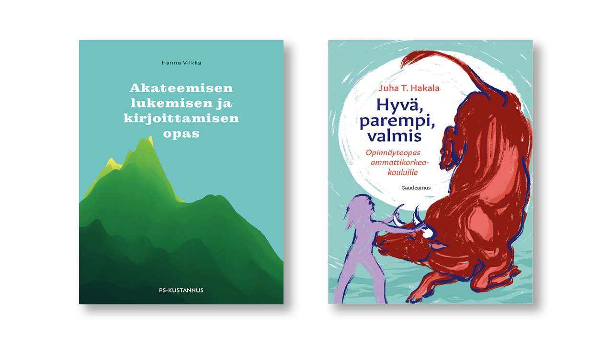

# 3: Miksi oppimispäiväkirja?

Oppimispäiväkirja on paljon enemmän kuin vain kurssisuoritus tai lokikirja tehdyistä tehtävistä. Se on työkalu ajattelusi kehittämiseen, asiantuntija-identiteettisi rakentamiseen ja osaamisesi näkyväksi tekemiseen. Sinä olet se, joka opiskelee ja oppii. Opettaja on valmentaja ja apu. Oppimispäiväkirja on se artefakti, jolla teet oppimisprosessistasi näkyvän, jotta opettajalla on jokin mahdollisuus antaa sinulle tekemistäsi vastaava arvosana. Se on siis kaksisuuntainen väline, joka palvelee sekä sinua että opettajaa.

Tässä luvussa käymme läpi, miksi oppimispäiväkirjaa ylipäätään kirjoitetaan, millaisia menetelmiä voit hyödyntää ajattelusi syventämisessä ja millaista kieltä asiantuntijalta odotetaan.

## Miksi kirjoittaa?

### Arvioinnin näkökulma

Yksi vastaus otsikon kysymykseen on, että *"jotta opettajalla olisi jokin artefakti, jonka perusteella arvioida osaamistasi."* Huomaa, että oppimispäiväkirja ei ole siis pelkästään itsereflektiivistä kirjoittamista, vaan se on myös todistus sinun osaamisestasi. Ota tämä huomioon kirjoittaessasi oppimispäiväkirjaa.

Arvioinnin pohjalla toimivat meta-arviointikriteerit näet klikkaamalla auki alla olevan *admonition*-laatikon. Arvointikriteerit esitellään kunkin kurssin alussa. Useilla kursseilla käytössä oleva arviointityökalu löytyy osoitteesta [arviointi.munpaas.com](https://arviointi.munpaas.com/).

??? tip "Meta-arviointikriteerit"

    Alla on meta-arvointikriteerit, jotka löytyvät [Pedagoginen toimintamalli 2022 - cKAMK 2.0](https://www.theseus.fi/handle/10024/508415) julkaisusta [^ckamk2]. Nämä kriteerit toimivat oppimispäiväkirjan arviointikriteereiden perustana. Jos haluat nähdä muiden kuin kiitettävien arvosanojen kriteerit, lue alkuperäinen julkaisu.

    **Kiitettävä (5)**
    
    Opiskelija osaa suhteessa osaamistavoitteisiin:
    
    **Tiedot**:
    
    * käyttää asiantuntevasti ja laaja-alaisesti ammattialansa käsitteitä sekä yhdistää niitä
    kokonaisuuksiksi.
    
    **Taidot**:

    * analysoida, vertailla, yhdistellä ja valita tietoa sekä esittää vaihtoehtoisia toimintatapoja
    * analysoida, reflektoida ja arvioida kriittisesti omaa osaamistaan ja ammattialansa toimintatapoja hankkimansa tiedon avulla
    * toimia itsenäisesti, vastuullisesti, aloitteellisesti ja joustavasti kulloisessakin oppimis- ja toimintaympäristössä
    * valita ja arvioida kriittisesti ammattialansa tekniikoita ja malleja sekä käyttää niitä toiminnassaan.
    
    **Asenteet**:

    * toimia asiakaslähtöisesti, tavoitteellisesti ja työelämää kehittävästi
    * toimia ryhmän jäsenenä edistäen ja kehittäen ryhmän toimintaa
    * soveltaa kriittisesti ammattieettisiä periaatteita toiminnassaan.

### Oppimisen näkökulma

Pelkkä arviointi ei kuitenkaan riitä syyksi. National Research Council:n komitean mukaan opetussuunnitelmat korostavat tyypillisesti enemmän muistia kuin ongelmanratkaisua [^bransford]. Oppikirjoissa on faktoja, jotka opiskelija opettelee ulkoa ja kirjoittaa tentissä oikeisiin kohtiin. Tämä on sekä opiskelijalle että opettajalle selkeä ja helppo tapa arvioida oppimista. Helppoudestaan huolimatta se ei ole ongelmaton. Kuten Bransford ja kumppanit toteavat, tenttiin pänttääminen aiheuttaa ns. kilometrin leveää ja senttimetrin syvää osaamista. Tämä tarkoittaa, että opiskelija osaa ulkoa faktoja, mutta ei osaa soveltaa niitä. Ongelma on erityisen vakava tietotekniikan alalla, jossa teknologia kehittyy nopeasti. Työntekijät odottavat työntekijöiltä ongelmanratkaisutaitoja, ei ulkoa opeteltuja faktoja [^rekrytointiselvitys].

!!! quote "Näkökulmia työelämästä"

    "Software engineering is more about what you can figure out than what you know."
    
    Franco Fernando @ LinkedIn [^franco]

Asiantuntijasta ei tee asiantuntijaa se, että hän osaa ulkoa paljon faktoja. Asiantuntijat ovat tehokkaita ongelmanratkaisijoita, tiedonhakijoita ja tiedon soveltajia. Hakkarainen ja kumppanit [^hakkarainen] tiivistävät, että: *"kirjoittaminen on kaikkein tärkein ajattelemaan oppimisen väline."* Oppimispäiväkirjan tavoitteena on siis auttaa sinua kehittymään asiantuntijaksi. 2000-luvun työntekijä ei voi olettaa saavansa esihenkilöltä yksiselitteisiä työtehtäviä. Olet ammattikorkeakoulussa valmistamassa itseäsi työelämään, joten työelämän tavat toimia on hyvä ottaa käyttöön jo nyt. Helppoa se ei suinkaan ole, kuten alla oleva (anonyymiksi muokattu) lainaus osoittaa:

!!! quote "Opiskelijan sanomaa"

    "Oppimispäiväkirjan aloittaminen tuntui melko vaikealta. Epävarmuutta herätti se, kirjoitinko olennaisia asioita vai toistiko vain lähdemateriaalia. Koin kuitenkin hyödylliseksi kirjata itselle ylös samat asiat omin sanoineni."

    — Anonyymi opiskelija

Kirjailija, tubettaja tai opettaja on jo kenties selittänyt termin siten, että sinulla olisi vain houkutus tarjota linkki. Aiheen selittäminen sinun omin sanoinesi on kuitenkin hyödyllistä. Se on hyödyllistä, koska se pakottaa sinut jäsentämään ja prosessoimaan tietoa. Et voi kirjoittaa opinnäytetyötäkään siten, että kirjan alussa toteat: *"Lue ensin nämä 3 kirjaa ja palaa sitten takaisin tähän tekstiin, kun ymmärrät jostain jotain."* Sinun tulee esitellä lukijalle ne termit, käsitteet ja teoriat, jotka ovat olennainen osa aihetta juuri siinä laajuudessa, missä aihetta käsittelet. Tämä vaatii, että teet valintoja: välttelet lillukanvarsia, keskityt olennaiseen.

### Pienet tavoitteet ja toisto

Oppiminen ei tapahdu heti eikä kerrasta. Se ei ole 100 metrin pikajuoksu. Se on lähempänä maratonia kuin pikajuoksua, mutta ei ole aivan maraton myöskään [^cf45f2]. Oppimispäiväkirja pohjaa tähän progressiivisen kehittymisen ideaan. Tavoitteena ei ole päntätä tenttiä varten vaan aiheuttaa ==pysyviä muutoksia== ajattelussasi.

Oppiminen ei tapahdu siten, että joku muu (opettaja) kaataa sinun päähäsi tietoa. Päinvastoin, oppiminen on aktiivista toimintaa, jossa **sinä itse olet pääosassa**. Mikäli oppiminen tuntuu liian helpolta, et todennäköisesti opi mitään. Tätä voi verrata kuntosaliharjoitteluun: voit kehittyä vain, jos nostat painoja, jotka ovat riittävän lähellä omaa maksimia. Kun kehityt, maksimi nousee, ja myös haastetta pitää kasvattaa. Tämä ei ole hatusta vedettyä pohdintaa, vaan aihetta on tutkinut muiden muassa Robert A Bjork. Hänen käsitettä *desireable difficulties* kansantajuistaa esimerkiksi David Didau sekä blogissaan [^didau] että kirjassaan *What if everything you knew about education was wrong?* [^9a6809].

* Tarvitset toistoja, toistoja ja toistoja.
* Aseta realistisia pieniä tavoitteita (vtr. "oma maksimi")
* Joudut sietämään epävarmuutta.
* Teet virheitä. Se on osa prosessia.

Mistä tunnistaa pieni tavoite? Tässä voit käyttää apuna SMART-periaatteita. Lue alta lisää SMART:sta.

!!! tip

    Kurssi on epäonnistunut, jos et osaa jatkossa soveltaa oppimaasi esimerkiksi projektityössä, harjoittelussa, työelämässä tai opinnäytetyössä. 
    
    Vertaus: Saat hygieniapassin kokeesta täydet pisteet. Viikon päästä leikkaat työvuorossa tyytyväisin mielin raakaa kanaa ja salaattia samalla veitsellä, ilman että mieleen juolahtaa pestä välineitä tai käsiä. Oppiminen on mennyt hukkaan.

## Menetelmiä

### SMART

Mistä tunnistaa pieni tavoite? Tässä voit käyttää apuna SMART-periaatteita [^ideapakka].

Alla oleva taulukko havainnollistaa, kuinka epämääräinen "Opiskelen koneoppimista" -ajatus puristetaan selkeäksi SMART-tavoitteeksi:

| SMART-kriteeri | Tavoite          | Esimerkki oppimispäiväkirjassa                                                                                      |
| -------------- | ---------------- | ------------------------------------------------------------------------------------------------------------------- |
| **S**pecific   | Tarkkaan rajattu | "Selitän teemamerkinnän aliotsikon alla, kuinka k-NN-algoritmi käytännössä toimii."                                 |
| **M**easurable | Mitattavissa     | "Tuotos on valmis, kun se sisältää 1 havainnollistavan kuvan ja noin 2 tekstikappaletta."                           |
| **A**chievable | Saavutettavissa  | "Rajaan aiheen vain algoritmin perusideaan. Tietolähteitä ovat luento, StatQuest ja Koneoppimisen perusteet kirja." |
| **R**elevant   | Olennaista       | "k-NN:n on viikon teema. Kurssi on osa minun HOPS:ia. Edistää valmistumista."                                       |
| **T**ime-bound | Aikataulutettu   | "Julkaisen muokatun tekstin 3 tunnin sisällä GitLabiin."                                                            |

### ELI5

Ei riitä, että osaat seurata vaihe vaiheelta eteneviä videotutoriaaleja. Ei myöskään riitä, että oppimispäiväkirjasi on tutoriaalimainen lista vaiheita. On tärkeää pohtia ja selvittää, miksi jokin asia on kuten se on. Tässä oiva apu on kirjoittamalla oppiminen. Sitä voi harjoittaa kuten Karnofsky [^7ef5f9] eli valitsemalla opittava aihe, tutkimalla aihetta, kirjaamalla **hypoteesin**, todistamalla hypoteesin oikeaksi tai vääräksi, ja toistamalla kunnes kokonaisuus kestää kasassa. Tämä muistuttaa hyvin lähelle perinteistä *tieteellistä menetelmää*. Myös *tutkiva oppiminen* on tähän läheisesti liittyvä termi [^hakkarainen]. 

Tähän liittyy myös läheisesti fyysikko Richard Feynmanin mukaan nimetty tekniikka, "Feynman Techinique" [^68dfb8]. Feynmanin tekniikasta useimmilla tuttua lienee lyhenne tai käsite ELI5 (*"Explain Like I'm 5"*).

!!! warning "Huono esimerkki"

    1. Asensin Ubuntun. Se on kuulemma hyvä Linux.
    2. Työpöytä näytti tavalliselta. Vaihdoin taustakuvan.
    3. Asensin ohjelmia klikkaamalla "asenna" -nappia.
    4. Ei ollut vaikeuksia.
    5. Opin juttuja Linuxista.

!!! tip "Parannusehdotuksia"

    Kuvittele vierellesi aiheesta tietämätön utelias lapsi. Vastaa hänen esittämiin kysymyksiinsä. Näitä voivat olla ==esimerkiksi==:

    * Mikä on Linux?
    * Miten Linux eroaa Windowsista tai MacOS:stä?
    * Onko käyttöjärjestelmä pakollinen?
    * Voiko sillä pelata?

Jos et kykene selittää aihetta yksinkertaisesti, kenties et ymmärrä sitä tarpeeksi hyvin.

### Kiplingin menetelmä (5W1H)

Jotta pääset pintaa syvemmälle, sinun on osattava kysyä oikeita kysymyksiä. Kirjailija Rudyard Kipling kiteytti uteliaisuuden ja oppimisen ytimen vuonna 1902 runossaan, joka alkaa "I keep six honest serving-men, (...) their names are What and Why and When and How and Where and Who." [^kiplingsociety]. Tämä runo on antanut nimensä tutkivan oppimisen 5W1H-metodille (What, Why, When, How, Where, Who). Se on erinomainen sapluuna oppimispäiväkirjan kirjoittamiseen erityisesti aiheista, jotka ovat sinulle entuudestaan vieraita [^cloud-5w1h]. Kun opettelet uutta konseptia, teknologiaa tai ohjelmointikieltä, käske nämä "kuusi palvelijaa" töihin:

1. **Mitä (What?)**: Mikä `AIHE` on, ja erityisesti, mikä se ei ole?
2. **Miksi (Why?)**: Miksi `AIHE` on olemassa? Minkä ongelman se ratkaisee?
3. **Miten (How?)**: Miten `AIHE` toimii konepellin alla? Miten sitä käytetään käytännössä?
4. **Missä (Where?) ja Milloin (When?)**: Missä tilanteissa `AIHEEN` käyttö on perusteltua? Milloin se epäonnistuu tai on väärä valinta?
5. **Kuka (Who?)**: Kuka on tämän `AIHEEN` pääasiallinen käyttäjä? Kuka hyötyy siitä eniten?

### Tekoäly sparraajana

Kielimallit eli tekoälypohjaiset chat-botit tuovat tähän oman lisänsä. Voisi kuvitella, että teknologisista vempaimista olisi pelkkää haittaa, mutta tuoreehkot meta-analyysit osoittavat, että esimerkiksi ChatGPT:n käyttö voi parantaa opiskelijoiden oppimistuloksia [^3dbfe5]. Tälle löytyy kuitenkin vastaväitteitä, kuten MIT:n tutkijoiden artikkeli *Your Brain on ChatGPT* [^brainongpt] tai Antropicin *How AI Impacts Skill Formation*, jossa todetaan selkeästi, että: *"In our work, users who relied on AI without thinking performed the worst on the evaluation"* [^aiskillformation]. Minun tulkintani on, että tekoälyä voi käyttää joko oppimisen edistämiseen – ikään kuin tukiopettajana – tai väärin käytettynä oppimisen tyrehdyttämiseen. Mikäli tekoälyn antaa tehdä ajatustyön itsensä puolesta, kognitiivinen kuorma vähenee, mikä on toki miellyttävä tunne, mutta oppimiselle haitallista. Tämä vaatii itsehillintää opiskelijalta. Minun ajatustani puoltaa artikkeli *AI Tools in Society: Impacts on Cognitive Offloading and the Future of Critical Thinking* [^aicriticalthinking].

Mike Amundsen lausui O'Reilly AI Codecon 2026 -konferenssissa, esityksessään *"From Automation to Augmentation"* [^amundsen], että valtaosa kielimallien käyttäjistä käyttää kielimalleja suorien vastauksien generointiin (engl. *as a generator*) tai ohjeiden saamiseen (engl. *as a surrogate*). Vain pieni osa hyödyntää tehokasta tapaa: käyttää sitä tukemaan ja haastamaan omaa ajattelua (engl. *as an instrument*). Hänen antamansa osuudet ovat alla luettelossa.

* Generator: 60–70 %
* Surrogate: 20–30 %
* Instrument: 5–10 %

Jos haluat kuulua Amundsenin määrittelemään 5–10 %:n vähemmistöön (lue: paremmistoon), käytä tekoälyä *"getting better at better"* -periaatteella. Älä kopioi valmiita vastauksia oppimispäiväkirjaasi. Kirjoita ensin oma ajatuksesi auki ja kysy sitten tekoälyltä: *"Mitä näkökulmia jätin huomioimatta?"* tai pallottele 5W1H-kysymyksiä sen kanssa.

## Akateeminen tyyli

Edellä esitellyt menetelmät, kuten ELI5 ja 5W1H, auttavat sinua jäsentämään omaa ajatteluasi ja taklaamaan oppimisen vaatimia suotuisia vaikeuksia. Asiantuntijana pelkkä oma ymmärrys ei kuitenkaan riitä, vaan sinun on pystyttävä viestimään osaamisesi ja oivalluksesi muulle ammattiyhteisölle. Akateeminen tyyli on ikään kuin tämän asiantuntijaviestinnän käyttöliittymä. Se on tapa pukea vaivalla jäsennelty ajattelu muotoon, joka on uskottava, johdonmukainen ja opettajan (sekä tulevien kollegojen) ymmärrettävissä. Oppimispäiväkirja on tälle hyvä harjoituskenttä, joka valmentaa sinua kohti opinnäytetyötä, joka on amk-tutkinnon huipentuma ja tärkein asiantuntijaviestinnän artefakti opintojesi aikana.

**Kuvio 2:** *Akateemista lukemista ja kirjoittamista kannattaa opetella opiskeluiden aikana. Yksi tapa on tutustua KAMK:n e-kirjaston kirjoihin. Näistä näkyy kuvassa kaksi: Akateemisen lukemisen ja kirjoittamisen opas (Vilkka H. 2020) sekä Hyvä, parempi, valmis: Opinnäytetyöopas ammattikorkeakouluille (Takala, J. 2023)*

Akateeminen kirjoittaminen on tiedonluomisen ja luovan ongelmanratkaisun metodi. Siihen liittyviä taitoja ovat tiedonhakutaidot, tiedonarviointitaidot sekä tiedon soveltamisen taito. Ammattikorkeakoulun koulutuksen yksi pyrkimys on, että kykenet työelämässä luomaan selvityksiä tai raportteja, joiden sisältö on johdonmukaista ja perusteltua. Koulutuksen aikana näitä tekstilajeja ovat opinnäytetyö ja oppimispäiväkirja, mutta työelämässä saatat joutua vertailemaan, mikä tarjolla olevista palveluista sopii parhaiten yrityksen käyttötarkoitukseen [^akateemisen]. Sinun tulisi osata ajatella analyyttisesti ja luoda sellainen tutkimuksellinen asetelma, joka mahdollistaa palveluiden vertailemisen systemaattisesti. Vertailun tulokset tulee osata esittää siten, että esihenkilö tai muu tilaaja ymmärtää sinun löydöksesi, ja kyetä osoittamaan, mistä olet hankkinut tietosi ja millä perusteella arvioit sen olevan uskottavaa tietoa.

### Oppimispäiväkirjan tyyli

Oppimispäiväkirjan tekstissä saa kuulua sinun oma äänesi. Tyylin tulee olla asiallista, mutta sen ei tarvitse olla kuivaa. Oppimispäiväkirjan saa kirjoittaa minä-muodossa.

!!! quote

    "Oppimispäiväkirja on oman oppimisen reflektointia taaksepäin ja eteenpäin. Oppimispäiväkirja pyrkii olemaan kokonaisuus, jossa opintojaksolla opitun avulla pystyt laventamaan aiempaa osaamistasi tai muuttamaan oma ajattelutapaasi. Merkittävintä tekstissä ovat opintojaksolla esitetyt, sinulle tärkeät käsitteet tai teoriat, joiden olet huomannut muuttaneen ajatteluasi tai asenteitasi."

    Hanna Vilkka [^akateemisen]

Oppimispäiväkirja ei voi kuitenkaan olla pelkkää reflektiivistä sisäistä pohdintaa ja omien tunteiden tulkintaa. Arvosteluasteikon keskiössä on se, kuinka hyvin olet ymmärtänyt opintojakson sisällön ja miten hyvin osaat soveltaa sitä. Varmista, että merkinnöistä käy ilmi sinun osaamisesi taso.

### Lue opinnäytetöitä

Yllä mainittujen oppaiden lukeminen on hyödyllistä, mutta väitän, että paras tapa oppia on joko lukea tai kirjoittaa akateemista tekstiä itse. Siispä kannattaa tutustua muiden opiskelijoiden kirjoittamiin opinnäytetöihin. Millainen niiden rakenne on? Millaista on kieli? Tunnistatko mielestäsi hyvän opinnäytetyön huonosta. Miten? Kuinka koodisnippettejä käytetään ja kuinka pitkiä niissä näkyvä koodi tyypillisesti on? Kuinka koodisnippettejä käsitellään leipätekstissä?

Esimerkkejä löydät Theseus-palvelusta, esimerkiksi hakemalla avainsanalla `data science` tai `data-analytiikka`. Vaihtoehtoisesti voit unohtaa hakusanat ja etsiä rajaimien avulla: valitse kokoelma **Kajaanin ammattikorkeakoulu** . Tämän jälkeen rajaa hakutuloksia koulutusalan mukaan **Tieto- ja viestintätekniikka**, lopulta vielä haluamallasi avainsanalla, kuten **ohjelmistokehitys**. Tässä suora linkki juuri tähän hakuun: [Theseus: Kajaanin ammattikorkeakoulu, data science, tieto- ja viestintätekniikka, ohjelmistokehitys](https://www.theseus.fi/handle/10024/1967/discover?filtertype_0=koulutusala&filter_relational_operator_0=equals&filter_0=fi%3DTieto-+ja+viestint%C3%A4tekniikka%7Csv%3DInformations-+och+kommunikationsteknik%7Cen%3DInformation+and+Communications+Technology%7C&filtertype=subjects&filter_relational_operator=equals&filter=ohjelmistokehitys).

### Lue alan julkaisuja

Silmäile myös alan julkaisuja, joita löytyy usein termillä `whitepaper` tai `scholarly article`. Millaista kieltä ja tyyliasua niissä käytetään? Mihin lähteisiin niissä viitataan ja miten? Alla pari suositusta:

* Cornell Uni (Michael, P. et. al.):  [Noise-Coded Illumination](https://peterfmichael.com/nci/)
* Uni of Westminster (Al-batat, R. et. al)[An End-to-End Automated License Plate Recognition System Using YOLO Based Vehicle and License Plate Detection with Vehicle Classification](https://www.mdpi.com/1424-8220/22/23/9477)
* Databricks: [Lakehouse: A New Generation of Open Platforms that Unify Data Warehousing and Advanced Analytics](https://www.cidrdb.org/cidr2021/papers/cidr2021_paper17.pdf)
* Google: [The Google File System](https://static.googleusercontent.com/media/research.google.com/en//archive/gfs-sosp2003.pdf)
* Netflix: [Abuse and Fraud Detection in Streaming Services Using Heuristic-Aware Machine Learning](https://arxiv.org/abs/2203.02124)
* Google: [Attention Is All You Need](https://arxiv.org/abs/1706.03762)
* Garmin: [Effects of Missing Data on Heart Rate Variability Measured From A Smartwatch: Exploratory Observational Study](https://formative.jmir.org/2025/1/e53645)

Huomaa kuitenkin, että yllä listatut ovat pääasiassa akateemisen kentän tuotoksia. Me teemme ammattikorkeakoulussa useimmiten toiminnallisia projekteja ja opinnäytetöitä. Tämä aiheuttaa eroavaisuuksia, joihin tulet tutustumaan kursseilla, joissa sinua valmennetaan opinnäytetyön kirjoittajana. 

### Lue alan kirjallisuutta

Jos olet elämäsi varrella lukenut vain vähän asiatekstiä, on kannattavaa lukea opintojen aikana alan ammattikirjallisuutta. Esimerkiksi [No Starch Press](https://nostarch.com/) julkaisee kirjoja, jotka ovat teknisiä, mutta kirjoitettu rennolla tyylillä. [Manning](https://www.manning.com/) ja [O'Reilly](https://www.oreilly.com/) julkaisevat karvan verran vähemmän rentoa kirjallisuutta, mutta silti asiallista ja helposti lähestyttävää. [Packt Publishing](https://www.packtpub.com/) on myös tutustumisen arvoinen. Useimmilla kustantajilla on oma subscription-palvelu, josta saa kokeilujakson: kannattaa sijoittaa kokeilujakso ajalle, jolloin sinulla on realistisesti aikaa lukea. Alan kirjoja on myös mahdollisuus tilata koulun KAMK Finna -e-kirjastoon.

IT-ammattikirjallisuutta on fyysisissä kirjastoissa hyvin rajatusti tarjolla, mutta esimerkiksi alan etiikkaa tai muita kansantajuisia ulottuvuuksia käsitteleviä teoksia löytyy paperisina kirjoina. Kannattaa siis tutustua kotikaupunkisi kirjaston tarjontaan. Näitä yleistajuisia teoksia löytyy lisäksi äänikirjapalveluista.

## Lähdeluettelo

[^ckamk2]: Oikarinen, A. *Arviointikriteerit osaamisen arvioinnissa*. 2022. Julkaistu teoksessa *Pedagoginen toimintamalli 2022 - cKAMK 2.0* (toim. Dahl, P., Rajander, T. & Saari, M). https://www.theseus.fi/handle/10024/508415
[^bransford]: Bransford, J. D., Brown, A. & Cocking, R. *Miten opimme: Aivot, mieli, kokemus ja koulu* (A. Penttilä, suom.). Helsinki: WSOY. 2004.
[^rekrytointiselvitys]: Myllymäki, M., Laine, S. & Hakala, I. *ICT-alan rekrytointiselvitys Keski-Pohjanmaalla*. 2023. https://cinetcampus.fi/site/assets/files/2246/ict-rekry_raportti.pdf
[^franco]: Franco, F. *Untitled LinkedIn post*. https://www.linkedin.com/feed/update/urn\:li:activity:7164168809942085632
[^hakkarainen]: Hakkarainen, K., Lonka, K. & Lipponen, L. *Tutkiva oppiminen: Järki, tunteet ja kulttuuri oppimisen sytyttäjinä*. Helsinki: WSOY. 2004.
[^didau]: Didau, D. *Deliberately difficult – why it's better to make learning harder*. https://learningspy.co.uk/featured/deliberately-difficult-focussing-on-learning-rather-than-progress-2/
[^ideapakka]: Ideapakka. *SMART on fiksu työkalu tavoitteiden suunnitteluun!*. https://ideapakka.fi/blogi/suunnittelu-smart/
[^7ef5f9]: Karnorfsky, H. *Learning by Writing*. https://www.cold-takes.com/learning-by-writing/
[^68dfb8]: Osmani, A. Write about what you learn. *It pushes you to understand topics better*. 2023. https://addyosmani.com/blog/write-learn/
[^kiplingsociety]: The Kipling Society. *The Elephant's Child*. https://www.kiplingsociety.co.uk/poem/poems_serving.htm
[^cloud-5w1h]: Changjiang, J., Cai, Y, Tak Yu, Y. & Tse, T.H. *5W+1H pattern: A perspective of systematic mapping studies and a case study on cloud software testing*. 2016. Journal of Systems and Software. https://doi.org/10.1016/j.jss.2015.01.058
[^3dbfe5]: Wang, J & Fan, W. The effect of ChatGPT on students’ learning performance, learning perception, and higher-order thinking: insights from a meta-analysis. Humanit Soc Sci Commun 12, 621. 2025. https://doi.org/10.1057/s41599-025-04787-y
[^brainongpt]: Kosmyna, N, et. al. *Your Brain on ChatGPT: Accumulation of Cognitive Debt when Using an AI Assistant for Essay Writing Task*. https://arxiv.org/abs/2506.08872
[^aiskillformation]: Shen, J. & Tamkin, A. *How AI Impacts Skill Formation*. 2026.https://arxiv.org/abs/2601.20245
[^aicriticalthinking]: Gerlich, M. *AI Tools in Society: Impacts on Cognitive Offloading and the Future of Critical Thinking*. Societies. 2025. https://doi.org/10.3390/soc15010006
[^amundsen]: Amundsen, M. *From Automation to Augmentation*. O'Reilly AI Codecon 2026. 2026-03-26.
[^cf45f2]: Collegial. *Learning is not a sprint.* https://www.collegial.com/insights/learning-is-not-sprinting
[^9a6809]: Didau, D. 2015. *What if everything you knew about education was wrong?*. [Apple Books e-kirja]. Crown House Publishing.
[^akateemisen]: Vilkka, H. *Akateemisen lukemisen ja kirjoittamisen opas.* Jyväskylä: PS-Kustannus. 2020.
