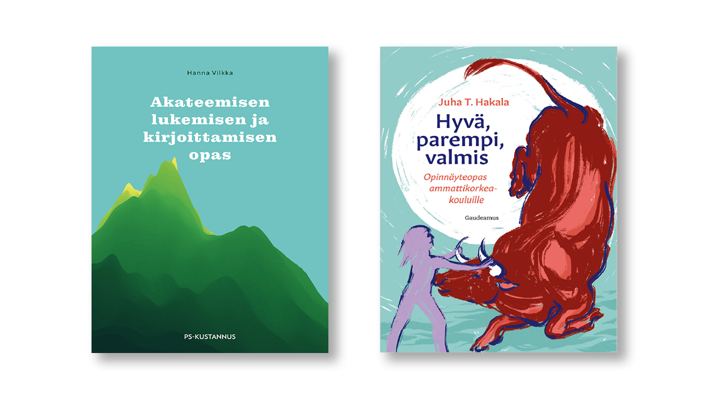

# 4: Akateeminen tyyli

## Akateeminen kirjoittaminen

**Kuvio 2:** *Akateemista lukemista ja kirjoittamista kannattaa opetella opiskeluiden aikana. Yksi tapa on tutustua KAMK:n e-kirjaston kirjoihin. Näistä näkyy kuvassa kaksi: Akateemisen lukemisen ja kirjoittamisen opas (Vilkka H. 2020) sekä Hyvä, parempi, valmis: Opinnäytetyöopas ammattikorkeakouluille (Takala, J. 2023)*

Tämä luku perustuu kokonaisuudessaan *Akateemisen lukemisen ja kirjoittamisen oppaaseen*. Kyseisen teoksen lukeminen on äärimmäisen suositeltavaa. Akateemiseen kirjoittaminen on tiedonluomisen ja luovan ongelmanratkaisun metodi. Siihen liittyviä taitoja ovat tiedonhakutaidot, tiedonarviointitaidot sekä tiedon soveltamisen taito. Ammattikorkeakoulun koulutuksen yksi pyrkimys on, että kykenet työelämässä luomaan selvityksiä tai raportteja, joiden sisältö on johdonmukaista ja perusteltua. Koulutuksen aikana näitä tekstilajeja ovat opinnäytetyö ja oppimispäiväkirja, mutta työelämässä saatat joutua vertailemaan, mikä tarjolla olevista palveluista sopii parhaiten yrityksen käyttötarkoitukseen [^1d1c01]. Sinun tulisi osata ajatella analyyttisesti ja luoda sellainen tutkimuksellinen asetelma, joka mahdollistaa palveluiden vertailemisen systemaattisesti. Vertailun tulokset tulee osata esittää siten, että esihenkilö tai muu tilaaja ymmärtää sinun löydöksesi, ja kyetä osoittamaan, mistä olet hankkinut tietosi ja millä perusteella arvioit sen olevan uskottavaa tietoa.

## Oppimispäiväkirjan tyyli

Teoksessa on myös oma, hyvin lyhyt alalukunsa oppimispäiväkirjasta tyylilajina. Siitä on lainaus alla:

!!! quote

    "Oppimispäiväkirja on oman oppimisen reflektointia taaksepäin ja eteenpäin. Oppimispäiväkirja pyrkii olemaan kokonaisuus, jossa opintojaksolla opitun avulla pystyt laventamaan aiempaa osaamistasi tai muuttamaan oma ajattelutapaasi. Merkittävintä tekstissä ovat opintojaksolla esitetyt, sinulle tärkeät käsitteet tai teoriat, joiden olet huomannut muuttaneen ajatteluasi tai asenteitasi."

    Hanna Vilkka [^1d1c01]

Huomaathan, että oppimispäiväkirjan tekstissä saa kuulua sinun oma äänesi. Tyylin tulee olla asiallista, mutta sen ei tarvitse olla kuivaa. Oppimispäiväkirjan saa kirjoittaa minä-muodossa.

Oppimispäiväkirja ei voi kuitenkaan olla pelkkää reflektiivistä sisäistä pohdintaa ja omien tulteiden tulkintaa. Arvosteluasteikon keskiössä on se, kuinka hyvin olet ymmärtänyt opintojakson sisällön ja miten hyvin osaat soveltaa sitä. Varmista, että merkinnöistä käy ilmi sinun osaamisesi taso.

!!! tip

    Kannattaa tutustua muiden opiskelijoiden kirjoittamiin opinnäytetöihin. Millainen niiden rakenne on? Millaista on kieli? Tunnistatko mielestäsi hyvän opinnäytetyön huonosta. Miten?

!!! tip

    Silmäile myös alan julkaisuja, joita löytyy usein termillä `whitepaper`. Millaista kieltä ja tyyliasua niissä käytetään? Mihin lähteisiin niissä viitataan ja miten? Alla pari suositusta:

    * Databricks: [Lakehouse: A New Generation of Open Platforms that Unify Data Warehousing and Advanced Analytics](https://www.cidrdb.org/cidr2021/papers/cidr2021_paper17.pdf)
    * Google: [The Google File System](https://static.googleusercontent.com/media/research.google.com/en//archive/gfs-sosp2003.pdf)
    * Netflix: [Abuse and Fraud Detection in Streaming Services Using Heuristic-Aware Machine Learning](https://arxiv.org/pdf/2203.02124.pdf)
    * Polar Electro Oy: [Polar Fitness Test](https://www.polar.com/en/img/static/whitepapers/pdf/polar-fitness-test-white-paper.pdf)

## Opiskelijoiden esimerkkejä

Tulevaisuudessa tulen lisäämään tähän dokumentaatioon lisää opiskelijoiden tekemiä mallisuorituksia; kunhan sopivia tulee vastaan ja saan niiden julkaisuun luvan. Tällä hetkellä esimerkkejä on kaksi, ja ne kummatkin löytyvät `Viikkomerkinnät -> Opiskelijoiden esimerkkejä` -polusta navigaatiosta. Suorat linkit niihin ovat:

* [Naive Bayes](examples/naivebayes.md)
* [Paketinhallinta](examples/paketinhallinta.md)

## Lähdeluettelo

[^1d1c01]: Vilkka, H. *Akateemisen lukemisen ja kirjoittamisen opas.* Jyväskylä: PS-Kustannus. 2020.
