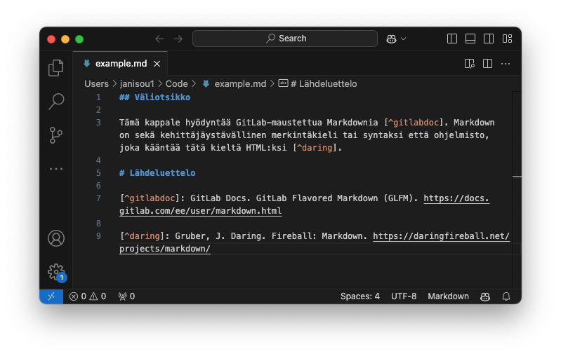
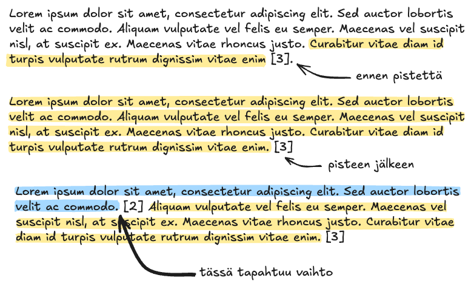
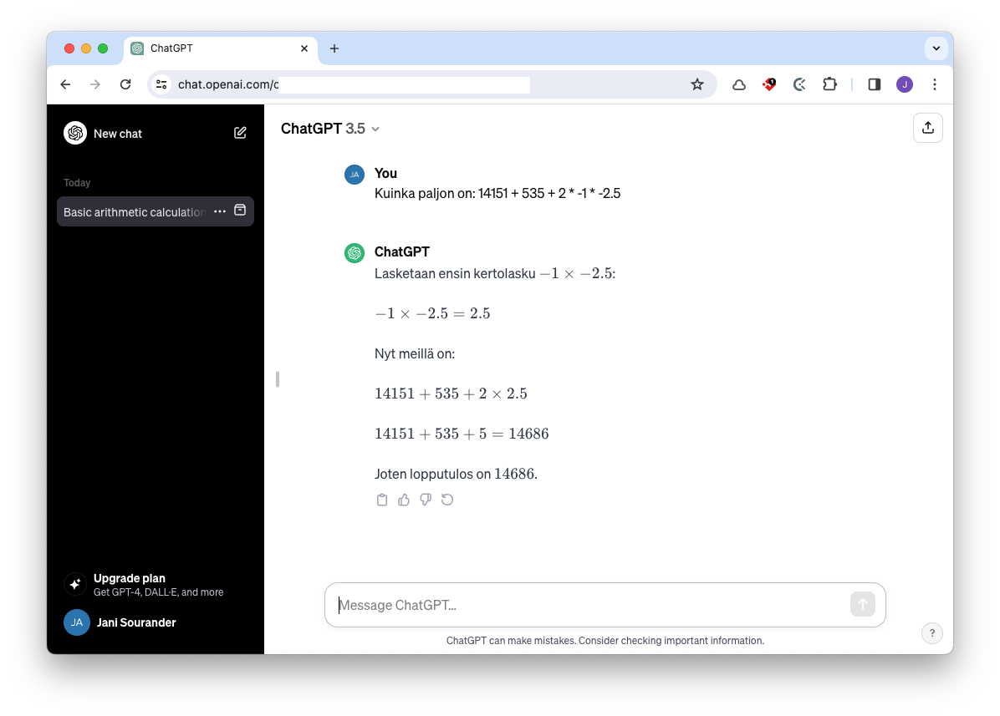

# 5: Lähdeviittausjärjestelmän käyttö

Lähdeviittaukset tehdään Vancouver-tyyliä **mukaillen**. Huomaa sana **mukaillen**. Opinnäytetyössä, akateemisissa julkaisuissa ja muissa raporteissa tulet noudattamaan esimerkiksi APA tai Vancouver lähdeviittausta orjallisesti ohjeiden mukaisesti. Oppimimispäiväkirjassa on riittävää, että käytät lähdeviittauksia, jotka ovat ymmärrettäviä ja johdonmukaisia. Voit käyttää tämän dokumentin lähdeviittauksia tyylillisenä ohjenuorana. Oppimispäiväkirjassa jätetään muun muassa viittauspäivämäärä pois, koska se selviää kontekstista, ja sivunumerot, koska Markdown ei salli niiden sisällyttämistä Footnoten sisään.

## OAT-spec

### Mikä?

Kuten opinnäytetyön tekijän oppaassa neuvotaan [^fcfce3], lähdeviite koostuu kahdesta osasta: **tekstiviitteestä** ja **lähdeluettelon vastineesta**. Tekstiviittauksen sisällä on viittauksen tunniste, joka on tyypillisessä Vancoucer-lähdeviittauksessa numero, mutta meillä on käytössämme opinnäytetyön ==arviointityökalun oma spesifikaatio== (lyhyesti OAT-spec). OAT-spec sallii tyypillisen numeron käytön, mutta numeroinnin ylläpito käsin on haastavaa. Meidän OAT-specin suositus on siis käyttää jotakin aliasta.

|                  | Vancouver                     | OAT-spec                               |
| ---------------- | ----------------------------- | -------------------------------------- |
| Tekstin sisällä  | `[1]`                         | `[^fff999]`                            |
| Lähdeluettelossa | `1: Tekijä. Teos. Ynnä. Muut` | `[^fff999]: Tekijä. Teos. Ynnä. Muut.` |

Alla luettelossa verrattuna kaksi OAT-specin suosittelemaa vaihtoehtoa: aliaksen käyttö ja MD5-tiivisteen käyttö.

Huomaa, että lähdeviitteet voivat olla joko **viitteitä**, kuten edellä olevassa kappaleessa, tai **suoria lainauksia**, kuten tämä: *"Lähteet numeroidaan lähdeluetteloon juoksevasti eli siinä järjestyksessä, missä ne esiintyvät tekstissä."[^fcfce3]*  Suorat lainaukset kuuluu asettaa lainausmerkkien väliin.



**Kuvio 1:** *OAT-specin mukainen lähdeviite näyttää käytännössä VS Codessa tältä. Material for MkDocs renderöi näistä tunnisteista myöhemmin numeroita, kuten `1` ja `2`*

Jos pohdit, että miksi me poikkeamme Vancouver-speksistä näin rankasti, niin syitä on useita. 

1. Me emme tuota PDF-tiedostoa Theseukseen vaan staattisen Mkdocs-dokumentaatiosivuston. 
2. Material for MkDocs korvaa merkkijonot numeroilla meidän puolestamme.

### Oat Tools

Oppimispäiväkirja 101:n avuksi on PyPi:stä löytyvä moduuli nimeltään [oat-tools](https://pypi.org/project/oat-tools/). Sen suhteen on oletus, että sinulla on `uv` asennettuna. Jos näin on, voit asentaa `oat-tools`-moduulin komennolla:

```bash
# Asenna
uv tool install oat-tools

# Päivitä jatkossa
uv tool update oat-tools
```

Tämän jälkeen voit käyttää `oat`-komentoa, jonka `uv` on asentanut koneellesi (hakemistoon `~/.local/bin/oat`). Työkalu neuvoo itse käyttöään, ja lisäksi yllä olevasta PyPi-linkistä löytyy dokumentaatio. Oat-työkalun avulla voit muun muassa:

```bash
# Laskea sanat (pois lukien koodilohkot)
oat wordcount path/to/file.md

# Tarkistaa, ettei orpoja tai puuttuvia lähdeviitteitä ole
oat references check path/to/file.md

# ⚠️ Korjaa lähdeviitteet ja järjestää lähdeluettelon (order of appearance)
oat references fix path/to/file.md
```

!!! warning "Vaarallinen komento ⚠️"

    Huomaa, että viimeisin komento, `references fix`, muokkaa tiedostoja. Aja tämä vain silloin, kun tiedosto on tallennettu, kommitattu ja puskettu Git remoteen eli GitLabiin. Muuten saatat menettää tiedostojen muutokset, jos minun skriptissä on bugi.

!!! tip

    Työkalu tukee useita argumentteja, joten voit käsitellä sillä usean tiedoston kerralla. Jos haluat käsitellä **kaikki** `docs`-hakemistossa ja sen alihakemistoissa olevat Markdown-tiedostot, aja komento:

    ```bash
    # Laske
    oat wordcount docs/**/*.md
    
    # Tarkista
    oat references check docs/**/*.md

    # Korjaa
    oat references fix docs/**/*.md
    ```

## Lähdeviitteiden käyttö

### Pisteen paikka

Lähdeviitteeillä on kaksi osaa, kuten yllä on jo todettu: leipätekstin sisällä oleva viite (*engl. in-text citation*) ja lähdeluettelo (*engl. reference list*). Tämä näkyy selkeästi yllä Kuviossa 1. On tärkeää ymmärtää, että leipätekstin viitettä ei voi sijoittaa summa mutikassa minne tahansa. On tärkeää, että **lukija ymmärtää, mikä osa on lähteteokseen perustuvaa, mikä on muuta pohdintaa**. Tässä on yksi apukeino pistesääntö. Katso Kuvio 2, jossa tätä havainnollistetaan.



**Kuvio 2:** *Se, onko lähdeviite ennen vai jälkeen virkkeen päättävän pisteen, on tärkeää. Kuviossa keltainen taustaväri tarkoittaa, että lause perustuu lähteeseen numero 3. Sinertävä väri tarkoittaa, että lause perustuu lähteeseen numero 2. Taustaväritön teksti olisi sinun omaan päättelyysi perustuvaa.*

Jos tämä ihmetyttää, tutustu aiheeseen toisen esimerkin kautta: [Opinnäytetyön tekijän opas: Lähdeviitteet ja lähdeluettelo (Vancouver)](https://libguides.kamk.fi/c.php?g=657740&p=5157950) -sivulta.

### Suora lainaus

Oppimispäiväkirjamerkintä ei saa olla lainauskokoelma. Valtaosa tekstistä tulee olla epäsuoria lainauksia tai sinun omaa pohdintaa. Suoria lainauksia tulee siis käyttää harkiten ja perustellusti. Suorat lainaukset tulee merkitä selkeästi lainausmerkein, ja lainauksen jälkeen tulee olla lähdeviite. 

!!! note "Suora lainaus tekstissä"

    Tämä olisi todennäköisesti kappaleen verran sinun tekstiäsi, josta päätyisit siihen, että haluat lainata suoraan lähdeteosta näin: *"Some of the shells that Bash has borrowed concepts from are the Bourne Shell (sh), the Korn Shell (ksh), and the C-shell (csh and its successor, tcsh)"* [^bash]. 

    Tämäkin olisi sinun tekstiäsi, ja tälläkin kertaa haluaisit jostain syystä lainata suoraan lähdetekstiä näin: *"Linux is normally used in combination with the GNU operating system: the whole system is basically GNU with Linux added, or GNU/Linux. All the so-called “Linux” distributions are really distributions of GNU/Linux"* [^gnulinux].

### Epäsuora lainaus

Jos selostat tekstiä omin sanoin (enlg. paraphrasing), et tarvitse lainausmerkkejä. Lukijalle tulee kuitenkin olla selvää, mikä osa tekstistä perustuu mihinkin lähteeseen. Apuna tässä toimii yllä mainittu pisteen paikka, mutta tämän lisäksi myös lauseen sisällöllä voi ohjata lukijaa. Alla pari esimerkkiä, joissa lausemuotoinen tapa ohjata lukijaa on korostettuna keltaisella.

!!! note "Epäsuora lainaus tekstisssä"

    Bash lainaa, ==kuten sen käyttöopas vahvistaa==, useita ominaisuuksia eri shell-ohjelmista eli kuorista. Näitä ovat muiden muassa Korn Shell (ksh) ja C-shell ja sen alkuperäinen esikuva Bourne Shell (sh) [^bash].

    ==Stallmanin mukaan== termi *Linux-käyttöjärjestelmä* on väärä, koska Linux-ydin on vain osa käyttöjärjestelmää. ==Hän ehdottaa==, että käyttöjärjestelmästä käytettäisiin nimeä GNU/Linux. [^gnulinux]

### Tieteellinen tieto

Tieteellisen tiedon suurin arvo ei johdu siitä, että tieto olisi totta [^40c08c]. Tieteellisen tiedon arvo on sen toistettavuudessa, läpinäkyvyydessä ja uusiutuvuudessa. Tämän vuoksi on tärkeää, että lähdeviitteet ja hypoteesin synty ovat yksiselitteisiä ja johdonmukaisia. Wikipedia on huono lähde: sillä on useita eri kirjoittajia, ja on vaikea sanoa, mitä siellä on milloinkin lukenut kenenkin sanomana. Wikipedia on hyvä lähde tiedon pläräilyyn *ensimmäisellä kerralla*, mutta tieto pitäisi varmistaa lähteistä - ja näihin Wikipedian artikkelit itsekin viittaavat. Suuret kielimallit kuten ChatGPT tai Gemini ovat vielä huonompia lähteitä kuin Wikipedia. Kielimallin kanssa keskustelusta voi saada hyviä ideoita, näkökulmia ja jopa sattumanvaraisesti oikeita vastauksia kysymyksiisi, mutta tämä ei ole millään tavoin tieteellisesti pätevä tapa hankkia tietoa. Kielimalli luo lauseita, jotka vaikuttavat oikeilta. Kielimalli ei tarkista faktoja tai punnitse tutkimustapojaan: se vain liimailee sopivia asioita yhteen.



**Kuvio 3:** *ChatGPT vastasi vielä 2024 väärin esimerkiksi tähän yksinkertaiseen matemaattiseen tehtävään. Se suoritti matemaattiset operaatiot sääntöjen mukaisessa järjestyksessä, mutta tyri lopulta yhteenlaskun. Oikea vastaus on 14691.*

!!! warning

    Ethän siis käytä kielimalleja lähteinä! Se laskee arvosanaasi. Tekoälyn käyttö muutoin oppimisen tukena tai tuutorina on kuitenkin äärimmäisen suositeltua!

    Haluan korostaa, että on täysin sallittua kertoa oppimispäiväkirjassa, mihin on käyttänyt tekoälyä ja mitä kukin kielimalli on antanut vastaukseksi promptiisi. Kielimallin käyttö ei siis ole ongelma. Kielimallien tarjoamien väitteiden tarkistamatta jättäminen on ongelma. On kovin tyypillistä, että kielimalli vastaa väärin, mutta vakuuttavasti. Ajoittain se myös keksii lähteitä, joita ole olemassa.

### Tulevaisuuden näkymät

Tulet tarvitsemaan lähdeviitteitä myöhemmin opiskelussasi, viimeistään kirjoittaessasi opinnäytetyötäsi. On siis hyvä, että harjoittelet lähdeviitteiden käyttöä jo nyt. Lähdeviitteiden hallintaa voi helpottaa käyttämällä jotakin viitteidenhallintajärjestelmää, kuten [Zoteroa](https://www.zotero.org/) tai [Mendeley Cite](https://www.mendeley.com/reference-management/mendeley-cite). Näihin kannattaa tutustua jo hyvissä ajoin ennen opinnäytetyön kirjoittamista. Voit kokeilla niitä jo nyt, jos haluat, mutta valitettavasti niitä ei ole integroitu tähän oppimispäiväkirjaan - eli ne eivät osaa OAT-speciä.

## Lähdeluettelo

[^fcfce3]: KAMK. *Opinnäytetyön tekijän opas: Lähdeviitteet ja lähdeluettelo (Vancouver)*. https://libguides.kamk.fi/c.php?g=657740&p=5157950
[^bash]: GNU. *Bash Reference Manual*. https://www.gnu.org/software/bash/manual/bash.html
[^gnulinux]: Stallman, R. *Linux and the GNU System*. https://www.gnu.org/gnu/linux-and-gnu.html
[^40c08c]: Hakkarainen, K., Lonka, K. & Lipponen, L. *Tutkiva oppiminen: Järki, tunteet ja kulttuuri oppimisen sytyttäjinä*. Helsinki: WSOY. 2004.
