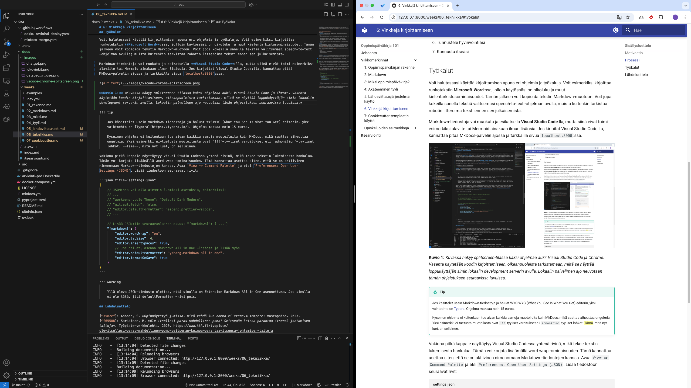

# 6: Vinkkejä kirjoittamiseen

## Sisällölliset vinkit

### Motivaatio

Kirjoittamisprosessissa aloittaminen tai joskus sen jatkaminen on vaikeaa. Tälle lamauttavalle tunteelle on jopa termi valkoisen paperin kammo (engl. writer's block.) Opinnäytetyö jumissa -kirja antaa muutamia askeleita, joilla voit yrittää voittaa tämän tunteen, ja näistä ensimmäinen on avata kirjoitettava dokumentti, tuijottaa sitä 10 sekuntia, ja analysoida omia tuntemuksiaan [^3582cf].

Minun motivaatiovinkkini ovat:

* **Aloita kirjoittaminen**: Kirjoita ensimmäinen lause. Se voi olla mikä tahansa. Se voi olla jopa `"TODO: Kirjoita tähän Linuxin asennusprosessista."`
* **Kirjoita usein**: Tee kirjoittamisesta tapa. Maksimoi ne kerrat, kun sinulla on oppimispäiväkirja auki tekstieditorissa.
* **Tee ensin, kirjoita sitten**: Lue alla olevasta infolaatikosta lisää.
* **Opi muilta**: Kysy kavereilta, mitä ja miten he kirjoittavat. Jaa kavereille omia kirjoituksiasi ja löytämiäsi vinkkejä kirjoitusprosessista.

!!! tip

    Jos sinulla olisi henkilökohtainen päiväkirja, jota kirjoittaisit päivittäin, mitä tekisit? Avaisitko sen aamulla miettien, että *"Mitähän tähän nyt pitikään kirjoittaa?"* Tuskin.

    Todennäköisemmin menisit ulos, tekisit jotakin ja kirjoittaisit kokemuksista päivän päätteeksi. Mitä aktiivisemman päivän eläisit, sitä enemmän sinulla olisi kirjoitettavaa. Kenties voisit mennä lounasravintolaan ruuhka-aikaan, kysyä "voiko tähän istua?", ja aloittaisit keskustelun tuntemattoman kanssa. Tai kenties päättäisit rohkeasti lähestyä LinkedIn-palvelussa henkilöä, joka työskentelee unelma-ammattisi parissa.
    
    Tee sama oppimispäiväkirjan kanssa. Jos sinulla ei ole mitään, mistä kirjoittaa, etsi kurssiin liittyviä harjoituksia, lue kurssikirjallisuutta, katso luentovideo, tee miellekartta tai aktivoi muutoin itseäsi. Kirjoita sitten.

### Prosessi

Kirjoititpa oppimispäiväkirjaa, opinnäytetyötä tai esseetä, massiivinen työ kannattaa pyrkiä purkaa pieniin osiin. Voit hyödyntää tässä ketterän ohjelmistokehityksen menetelmiä, kuten Scrumia, joka on sinulle esitelty KAMK:n kursseilla. Oppimispäiväkirjan kohdalla viikot ovat sprinttejä, ja jokaisella viikolla on jokin teema tai aihe. Voit kokeilla luoda TODO-listan viikoittaisista tehtävistä valitsemaasi työkaluun, kuten post-it -lappuihin, [Microsoft To-Do](https://to-do.office.com/tasks/today)-applikaatioon tai vaikkapa suoraan oppimispäiväkirjan kunkin viikon Markdown-tiedostoon.

Oman työn hallinta ja johtaminen on työelämässä tärkeä taito. Työterveyslaitoksen verkkolehdessä tarjotaan vinkkejä, jotka ovat tiivistetyssä muodossa seuraavat [^f65588]:

1. Aseta tavoitteita
2. Priorisoi
3. Suunnittele ajankäyttö
4. Työskentele silloin, kun olet tehokkaimmillasi
5. Tunnista stressi ja pidä yllä vireystilaa
6. Tunnustele hyvinvointiasi
7. Kannusta itseäsi 

## Tekniset vinkit

### Työkalut

Voit halutessasi käyttää kirjoittamisen apuna eri ohjelmia ja työkaluja. Voit esimerkiksi kirjoittaa runkotekstin **Microsoft Word**:ssa, jolloin käytössäsi on oikoluku ja muut kielentarkistusominaisuudet. Tämän jälkeen voit kopioida tekstin Markdown-muotoon. Voit jopa kokeilla sanella tekstiä valitsemasi speech-to-text -ohjelman avulla; muista kuitenkin tarkistaa robotin litteroima teksti ennen sen julkaisemista.

Markdown-tiedostoja voi muokata ja esikatsella **Visual Studio Code**:lla, mutta siinä eivät toimi esimerkiksi alaviite tai Mermaid ainakaan ilman lisäosia. Jos kirjoitat Visual Studio Code:lla, kannattaa pitää MkDocs-palvelin ajossa ja tarkkailla sivua `localhost:8000`:ssa.



**Kuvio 1:** *Kuvassa näkyy splitscreen-tilassa kaksi ohjelmaa auki: Visual Studio Code ja Chrome. Vasenta käytetään koodin kirjoittamiseen, oikeanpuoleista tarkistamaan, miltä se näyttää loppukäyttäjän silmin lokaalin development serverin avulla. Lokaalin palvelimen ajo neuvotaan tämän ohjeistuksen seuraavissa luvuissa (`HOW-TO-DOCS.md` tiedostossa, joka saapuu Cookiecutter-templaatin mukana).*

!!! tip

    Jos käsittelet usein Markdown-tiedostoja ja haluat WYSIWYG (What You See Is What You Get) editorin, yksi vaihtoehto on [Typora](https://typora.io/). Ohjelma maksaa noin 15 euroa.

    Kyseinen ohjelma ei kuitenkaan tue aivan kaikkia samoja muotoiluita kuin MkDocs, mikä saattaa aiheuttaa ongelmia. Yksi esimerkki ei-tuetusta muotoilusta ovat `!!!`-tyyliset varoitukset eli `admonition`-tyyliset lohkot. ==Tämä==, mitä nyt luet, on sellainen.

### Visual Studio Code asetukset

Vakiona pitkä kappale näyttäytyy Visual Studio Codessa yhtenä rivinä, mikä tekee tekstin lukemisesta hankalaa. Tämän voi korjata lisäämällä word wrap -ominaisuuden. Tämä kannattaa asettaa siten, että se on aktiivinen nimenomaan Markdown-tiedostojen kanssa. Avaa `View => Command Palette` ja etsi `Preferences: Open User Settings (JSON)`. Lisää tiedostoon seuraavat rivit:

```json title="settings.json"
{
    // JSON:ssa voi olla aiemmin luomiasi asetuksia, esimerkiksi:
    // ...
    // "workbench.colorTheme": "Default Dark Modern",
    // "git.autofetch": false,
    // "editor.defaultFormatter": "esbenp.prettier-vscode",
    // ...

    // Lisää JSON:iin seuraavanlainen osuus: "[markdown]": { ... }
    "[markdown]": {
        "editor.wordWrap": "on",
        "editor.tabSize": 4,
        "editor.insertSpaces": true,
        // Jos haluat, asenna Markdown All in One -lisäosa ja lisää myös
        "editor.defaultFormatter": "yzhang.markdown-all-in-one",
        "editor.formatOnSave": true
    }
}
```

!!! warning

    Yllä oleva JSON-tiedosto olettaa, että sinulla on Extension Markdown All in One asennettuna. Jos sinulla ei ole tätä, jätä defaultFormatter -rivi pois.

### Kielimallit

Voit käyttää kirjoittamisen apuna erilaisia kielimalleihin perustuvia chatbotteja. Näitä ovat esimerkiksi ChatGPT, Claude ja Gemini. Muista, että oppimispäiväkirjan tulee olla **sinun** työsi. Älä siis anna tekoälyn kirjoittaa tekstiä puolestasi. Tekoäly voi kuitenkin auttaa sinua ongelmanratkaisun jäsentämisessä, Markdown-syntaksin muotoilussa, Visual Studio Coden asetuksien säätämisessä, tai jopa oikoluvussa.

Kielimallien käyttämisessä hyvä puoli on se, että se opastaa sinua muotoilemaan hyvän kysymyksen. Kielimallit ovat huonoja vastaamaan epämääräisiin kysymyksiin, joten sinun tulee osata antaa kielimallille riittävästi kontekstia. Jos haluat kattavan ohjeen, katso alla oleva video.

<iframe width="560" height="315" src="https://www.youtube.com/embed/ysPbXH0LpIE?si=aGjRBsZ_KpmeA9cm" title="YouTube video player" frameborder="0" allow="accelerometer; autoplay; clipboard-write; encrypted-media; gyroscope; picture-in-picture; web-share" referrerpolicy="strict-origin-when-cross-origin" allowfullscreen></iframe>

**Video 1**: *Video Anthopic:n "Prompting 101 | Code w/ Claude" on luotu koodauksen näkökulmasta, mutta samoja context engineering -periaatteita voi soveltaa mihin tahansa aiheeseen.*

Video on pitkä, joten jos haluat vain tiivistelmän, tässä on muutama vinkki:

* Ole tarkka: vältä epämääräisiä kysymyksiä; näin minimoit hallusinaatiot.
* Anna relevantti koodi: jaa tiedostot, komennot tai snippetit, jotka ovat keskeisiä ongelman ymmärtämiseksi.
* Sisällytä laajempi kokonaisuus: selitä ongelman konteksti eli miksi teet mitä teet, millä työkalulla ja missä käyttöjärjestelmässä. Kerro myös, että kirjoitat oppimispäiväkirjaa opiskelua varten.
* Jaa virheilmoitukset: jos saat virheilmoituksia, jaa ne.
* Määrittele rajoitukset: kerro rajoitukset, kuten käytettävät työkalut tai teknologiat.

Yllä olevat vinkit ovat muotoiltu Andy Osmanin "Context Engineering"-seminaaripuheesta O'Reillyn Codecon-virtuaalitapahtumasta. [^andy] Hyvän kysymyksen muotoilussa menee aikaa. Joskus käy niin, että kun muotoilet kysymyksen hyvin, huomaat itsekin ratkaisun ongelmaasi ennen kuin ehdit lähettää kysymystä.

## Lähdeluettelo

[^3582cf]: Ahonen, S. *Opinnäytetyö jumissa. Mitä tehdä kun homma ei etene.* Tampere: Vastapaino. 2023.
[^f65588]: Sarkkinen, M. *Ole itsellesi paras mahdollinen pomo! Seitsemän keinoa parantaa itsensä johtamisen taitoja*. Työpiste-verkkolehti. 2020. https://www.ttl.fi/tyopiste/ole-itsellesi-paras-mahdollinen-pomo-seitseman-keinoa-parantaa-itsensa-johtamisen-taitoja
[^andy]: Osman, A. *Context Engineering*. Puheenvuoro tapahtumassa AI Codecon: Coding for the Agentic World. O'Reilly. 2025. https://learning.oreilly.com/live-events/ai-codecon-coding-for-the-agentic-world/0642572207748/0642572207731/