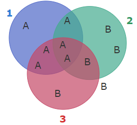
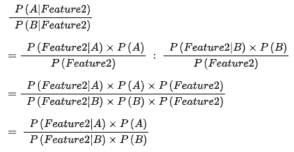

!!! warning "Lukuohje!"

    Tämä on opiskelijan Emma Sepänaho kurssin Johdatus Koneoppimiseen yksittäinen viikkomerkintä. Aiheena kyseisellä viikolla on koneoppimisalgoritmi Naive Bayes.

    Huomaa, että tämä on vain yksi useista oppimispäiväkirjan merkinnöistä. Tämä on nostettu esille ==hyvänä esimerkkinä teorian käsittelystä==. Palautetun repositorion tiedostot `koodit/src/playground/naive_bayes.ipynb` ja `vihapuhe.ipynb` sisälsivät lisätodisteita käytännön taitojen soveltamisesta. Ideaalitilanteessa Jupyter Notebookeista olisi kuvakaappaukset tai koodisnippetit tässä merkinnässä.


# Naive Bayes

Naive Bayes on koneoppimisalgoritmi, jonka teoriaan liittyy matematiikan kurssilta tuttu Bayesin teoreema: ```P(X|Y)=P(Y|X)P(X)/P(Y)```. [^koi] Teoreemalla pystytään selvittämään todennäköisyys tapahtumalle X olettaen, että Y tapahtuu, kun tiedetään todennäköisyydet yhtäsuuruusmerkin oikealla puolella. 

"Naive" algoritmin nimen alussa merkitsee olettamusta siitä, että tapahtuman muuttujat eli attribuutit ovat keskenään riippumattomia. Algoritmi siis olettaa, että ne eivät vaikuta toistensa esiintyvyyteen - on tämä tosimaailmassa totta tai ei. [^koi] [^bcd] Esimerkiksi siis roskapostisuodatin ei välitä siitä, esiintyyvätkö kaikki vai vain yksi sanoista *deluxe, hot* ja *girl*, eikä siitä, missä järjestyksessä nämä sanat olisivat [^fff].

Naive Bayes -mallia koulutettaessa koulutusdatan voi ajatella matriisina, johon on enkoodattu N-määrä attribuutteja, joista yksi on kunkin havainnon luokitus. Kukin havainto koostuu attribuuttien esiintymistä. Algoritmi laskee kaikkien havaintojen ja niiden luokitteluiden perusteella uskottavuustodennäköisyydet kunkin attribuutin esiintymisestä missäkin luokassa[^puu]. Kun vielä määritetään luokkien toteutumien suhde, saadaan luokille prioritodennäköisyydet, joita tarvitaan Bayesin kaavan käyttöön. Alla olevassa matriisissa priorit olisivat P(A) = 6/11 ja P(B) = 5/11. [^puu]

| Ominaisuus1 | Ominaisuus2 | Ominaisuus3 | Luokka |
| ----------- | ----------- | ----------- | ------ |
| 1           | 0           | 1           | A      |
| 0           | 1           | 0           | B      |
| 1           | 1           | 1           | A      |
| 0           | 0           | 1           | B      |
| 1           | 0           | 0           | A      |
| 0           | 1           | 1           | B      |
| 1           | 1           | 0           | A      |
| 0           | 0           | 0           | B      |
| 1           | 0           | 1           | A      |
| 0           | 1           | 0           | B      |
| 1           | 1           | 1           | A      |

*Esimerkkimatriisi koulutusdatasta.*

Jotta vältettäisiin nollatulokset koulutusdatassa esiintymättömyyden takia, on yleinen konventio lisätä alpha-luku kaikkiin mahdollisiin esiintymiin. Alpha voi olla periaatteessa mikä vain luonnollinen luku, mutta usein se on 1. Tällöin uskottavuustodennäköisyydeksi ei koskaan tule nolla, vaan jokin todella pieni desimaali kuten 0,000001. [^puu] [^fff] 

Yllä olevan matriisidatan uskottavuustodennäköisyydet olisivat siis:  

```
P(ominaisuus1 | A) = (6+α)/(6+α)  
P(ominaisuus2 | A) = (3+α)/(6+α)  
P(ominaisuus3 | A) = (4+α)/(6+α)  
P(ominaisuus1 | B) = (0+α)/(5+α)  
P(ominaisuus2 | B) = (3+α)/(5+α)  
P(ominaisuus3 | B) = (2+α)/(5+α)  
```



**Kuva 1:** *Venn-diagrammi havainnollistukseksi koulutusdatan jakaumasta.*

Palataan, vielä takaisin alkuperäiseen teoreemaan, jolla voidaan siis laskea posterioritodennäköisyys todisteiden, uskottavuuden ja prioritodennäköisyyden perusteella. 

```
P(X|Y) = posterioritodennäköisyys  
P(Y|X) = uskottavuus  
P(X) = oletus, prioritodennäköisyys  
P(Y) = todisteet 
```

Naive Bayes -koneoppimismallilla on tarkoitus luokitella havainto todennäköisimpään luokkaan. Tarkastellaan siis esim. suhdetta ```P(A|ominaisuus2):P(B|ominaisuus2)```. Tällöin jakaja eli "todisteet" voidaan unohtaa, koska jakaja on kaikissa posterioritodennäköisyyslaskuissa sama. [^fff] [^koi] Matemaattinen todistus alla:



Laskusta saadaan tulokseksi positiivinen rationaaliluku. Jos se on suurempi kuin 1, jaettava luokka (todistuksessa siis luokka A) on todennäköisempi kuin jakajan luokka. Jos luku on pienempi kuin 1, jakajan luokka (B) on todennäköisempi. [^fff] Mikäli algoritmia ei ole koodattu laskemaan suhdelukua, vaan kaksi eri arvoa kummallekin mahdolliselle luokalle, loppupäätelmä saadaan vertailemalla, kumpi posterioreista on suurempi. Tämä tapa on varmasti helpompi ymmärtää, jos luokkia on enemmän kuin kaksi. 

Toisaalta taas jos attribuuteista haluaa tarkastella useampaa kuin yhtä, tulee näille kullekin attribuutille laskea oma uskottavuustodennäisyys ja kertoa nämä keskenään, jotta saa selville "yhteisuskottavuustodennäköisyyden". Esimerkki attribuuttikohtaisista uskottavuustodennäköisyyksistä on yllä. Niiden avulla voitaisiin laskea vaikkapa todennäköisyys havainnolle kuulua A- tai B-luokkaan, jos havainnolla on ominaisuudet 2 ja 3:

```
P(A | ominaisuus2, ominaisuus3) 
= P(ominaisuus2 | A) * P(ominaisuus3 | A) * P(A)
= (3+α)/(6+α)  * (4+α)/(6+α) * 6/11
= 0,18

P(B | ominaisuus2, ominaisuus3) 
= P(ominaisuus2 | B) * P(ominaisuus3 | B) * P(B)
= (3+α)/(5+α) * (2+α)/(5+α) * 5/11
= 0,11

P(A | ominaisuus2, ominaisuus3) > P(B | ominaisuus2, ominaisuus3) 
==> Havainto kuuluu todennäköisemmin luokkaan A.
```

Naive Bayes -koneoppimisalgoritmeja on monia. Tyypillinen Naive Bayesin sovellutus on roskapostisuodatin. [^bcd] Lähdin ratkomaan suodattimen tapaista vihepuhetehtävää ScikitLearnin MultinominalNB:llä. Säilytin datasta vain luokat ja twiitit. Kun koulutetaan tekstintunnistajaa, datasta on hyvä siivota välimerkit, ja se on käsiteltävä sellaisessa muodossa, että tekstihavainnon sisältämiä sanoja arvioidaan erikseen; tämän opin kantapään kautta ensin Allure-tehtävässä yrittäessäni luokitella kokonaista tekstihavaintoa kerrallaan. Datan voi esikäsitellä esimerkiksi vektorisoimalla. [^goo] Sain mallin koulutettua, mutta koko datasetillä pelattaessa, se ei tunnista vihepuheviestejä lainkaan. Toisen opiskelijan esimerkkiä mukaillen otin datasta kaikki vihapuheeksi enkoodatut havainnot ja saman verran ei-vihapuhetwiittejä.[^goo] Tämän jälkeen ennustaminenkin alkoi toimia (accuracy 88%). Koulutusdatan tasapainoisuus saattaa siis vaikuttaa mallin toimintaan. 

Naive Bayesin kaltaisen algoritmin käyttö vaatii suurta ihmisen panosta: esimerkiksi vihapuheen luokittelu on ensin tehtävä ihmisvoimin, jotta olisi dataa, jolla malli kouluttaa. Toiseksi on pohdittava sitä, mitä ja millaista data on: opettaja nosti esiin, että esimerkiksi vihapuhetta luokiteltaessa käyttäjien nimimerkit olisi hyvä poistaa, joitteivät nimet vaikuttaisi luokitteluun ja jottei tiettyjen ihmisten viestejä aina luokiteltaisi vihapuheeksi. Lisäksi funktiosanat voi jättää huomiotta, koska ne eivät kanna sisällöllistä painoarvoa, esiintyvät ne vihapuhe- tai tavallisessa viestissä.[^goo] [^isk]

## Lähteet
[^koi]: Sourander, J. (2024): Koneoppimisen perusteet -verkkomateriaali. Kajaanin Ammattikorkeakoulu Oy. https://sourander.github.io/ml-perusteet/. 
[^bcd]: Rouse, M. (2019): Naive Bayes.Techopedia. https://www.techopedia.com/definition/32335/naive-bayes  
[^fff]: MinnaLearn & Helsingin yliopisto (2024): Elements of AI -kurssimateriaali. https://course.elementsofai.com
[^puu]: StatQuest with Josh Stramer (2020): Naive Bayes, Clearly Explained!!!. Youtube. https://www.youtube.com/watch?v=O2L2Uv9pdDA.  
[^goo]: Sourander, J. (2024): 2. luento. Johdatus koneoppimiseen -kurssi. Kajaanin Ammattikorkeakoulu Oy.
[^isk]: Iso suomen kielioppi (2008): § 438 Sanaluokkajaon perusteet. Verkkoversio. https://kaino.kotus.fi/visk/sisallys.php?p=438.  