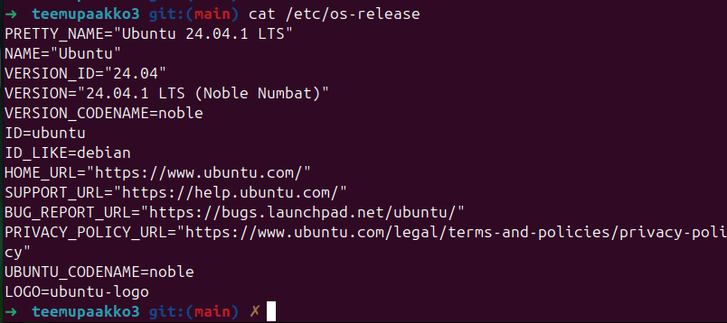
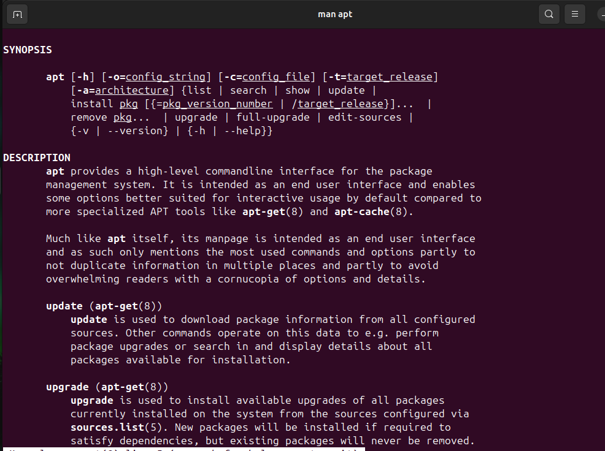
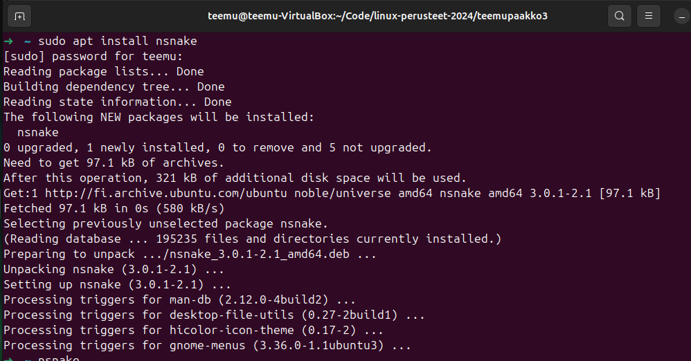
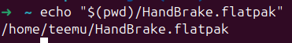
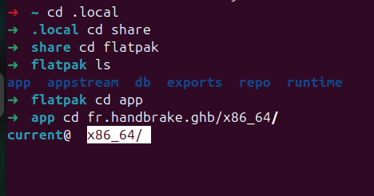

!!! warning

    Tämä on opiskelijan Teemu Pääkkö kurssin Linux Perusteet yksittäinen viikkomerkintä. Aiheena kyseisellä viikolla on paketinhallinta.

    Huomaa, että tämä on vain yksi useista oppimispäiväkirjan merkinnöistä. Tämä on nostettu esille ==hyvänä esimerkkinä tekstin, kuvien ja koodisnippettien yhdistelemisestä== tasapainoiseksi kokonaisuudeksi.

# Paketinhallinta

## Ohjelmat

### Ohjelmien ajaminen

Linux pohjaisissa laitteissa voidaan luoda erilaisia tiedostoja tai binääritiedostoja, joita voidaan ajaa terminaalin kautta. Näitä tiedostoja voi kirjoittaa esimerkiksi nodella terminaalin sisällä. Tiedoston alkuun tulee kirjoittaa, miten tiedostoa tulee ajaa. Esimerkiksi, jos halutaan ajaa ohjelmaa bashillä kirjoitetaan ```#!/bin/bash``` tai vaihtoehtoisesti pythonina ```#!/usr/bin/env python3```. Tiedostoa luodessa tiedostolla ei lähtökohtaisesti ole executable oikeuksia. Nämä oikeudet tulee antaa tiedostolle, jotta sen ajaminen onnistuu. Executable oikeuksien antaminen onnistuu ```chmod +x tiedostonimi``` komennolla. Tämän jälkeen ohjelmaa voi ajaa kansiossa komennolla ```./tiedostonimi```. Jos halutaan tehdä ohjelmasta sellainen, että sen voi ajaa muuallakin kuin kyseisessä kansiossa, tulee ohjelma kiinnittää PATH:iin. Tämä onnistuu ```export PATH="tiedosto polku tähän:$PATH"``` komennolla. Tämän jälkeen ohjelman voi nyt ajaa muissa kansioissa kuten kotikansiossa. [^giada]

### Paketinhallintaan liittyvää termistöä

Tiivistelmä Learning Modern Linux (Hausenblas 2022)-kirjan Chapter 6 alusta. [^ghagra]

- Program (ohjelma) on binääritiedosto tai ajettavaksi merkattu tekstitiedosto.

- Process (prosessi) on ohjelman instanssi, joka käyttää CPU:ta tai I/O:ta.

- Daemon on taustalla ajettava prosessi, jota kutsutaan myös serviceksi.

- Application tai app (sovellus) tarkoittaa ohjelmaa ja sen riippuvuuksia kokonaisuudessaan kuten konfiguraatiot, data, asennus, poisto ja ajaminen.

- Package (ohjelmapaketti) on tiedosto, joka sisältää ohjelmia tai applikaatioita.

- Package manager (paketinhallinta) on ohjelma, joka lukee, asentaa, päivittää ja poistaa ohjelmapaketteja. Pythonin paketinhallinta ohjelma on ```pip``` ja Debian-pohjaisissa järjestelmissä ohjelma on ```apt```.

- Repositorio on kirjasto, josta paketinhallintajärjestelmä noutaa ohjelmat ja johon ne päivitetään.

## Ohjelmapaketit

Aplikaatiot eli ohjelmat jaetaan laitteille tyypillisesti ohjelmapaketteina. Näitä paketteja ovat muun muassa: [^giada]

- .deb, joka on Debian-pohjaisten Linux distribuutioiden käyttämä formaatti.

- .rpm, joka on Red Hat-pohjaisten Linux distribuutioiden käyttämä formaatti.

- .pkg.tar.zst, joka on Arch Linuxin pacmanin käyttämä formaatti.

- .apk, joka on Alpine:n apk:n käyttämä formaatti.

- .ebuild, joka on Gentoo:n Portagen käyttämä formaatti.

- .tar, .tar.gz, tar.bz2 eivät ole varsinaisesti omia formaatteja paketille, mutta osa ohjelmistoista levitetään pakattuina tarpaketteina.

### Pakettien käsittely

Vaikka Windowsin maailmasta tuttu zippin kaltaisten pakettien lataus on mahdollista Linuxilla, tulee sitä kuitenkin vältää, jos mahdollista. ```tarball```-tyylisessä paketissa voi olla valmiiksi ohjelmassa joitain riippuvuuksia, jotka on hankala poistaa. [^giada]

Debian-pohjaisissa laitteissa suositaan pakettien lataamista ```apt``` tai ```apt-get``` komentojen avulla. Red Hat-pohjaisissa laitteissa käytetään ```yum``` tai ```DNF``` komentoja. ```DNF``` on päivitetty versio ```yum```:sta. Red Hat-distribuution laitteissa ei kuitenkaan ole merkitystä kumpaa komentoa käyttää, sillä ```yum``` komentoa ajaessa toteutuu nykyisin ```DNF``` komento. Näillä samoilla komennoilla onnistuu myös ohjelmistojen päivitys ja poistaminen. [^giada]


### Distribuution selvittäminen

Jos haluaa selvittää, mitä distribuutiota ja täten mitä pakettienhallinta menetelmää laite käyttää, voi sen selvittää seuraavalla komennolla:
```cat /etc/os-release``` [^giada]



**Kuva 1** *Ubuntu 24.04 distribuutio*

Kuten kuvasta näkyy laitteellani on käytössä Debian. Täten apt toimii paketinhallintanani.

Enemmän tietoa apt komennosta saan haettua Linuxin manuaalista komennolla ```man apt```. 



**Kuva 2** *Man apt komento*

### Repositoriot

Tavallisesti paketteja ei ladata käsin koneelle. Paketinhallinta työkalut hakevat paketit suoraan repositoriosta. Käytössä olevat repositoriot riippuvat distribuutiosta. [^giada]

Joskus jokin ohjelma voi neuvoa lisäämään uuden repositorion distribuution listaan, tällöin tulee olla tarkkana siitä, mitä lataa. Tämä siksi, koska kyseessä on kolmannen osapuolen tekemä repositorio ja voi täten sisältää mitä tahansa. [^giada]

Ubuntussa repositorioon voi tutustua komennolla ```vim /etc/apt/sources.list.d/ubuntu.sources```. Ubuntun julkaisemissa repositorioissa löytyy ubuntu archiven allekirjoitus. [^giada]

### Komennot

Repositoriosta lähtöisin olevan metadatan voi päivittää ```update``` komennolla.

Perus komennot Red Hat-distribuutiolla: [^giada]
```SHELL
# DNF 
# Päivitä ohjelmat
$ sudo dnf check-update
$ sudo dnf upgrade

# Listaa asennetut ohjelmat
$ dnf list installed

# Etsi uusia ohjelmia ja lue info
$ dnf search "hakusana"
$ dnf info <package-name>

# Listaa ohjelman tiedostot
$ rpm -q1 <package-name>

# Tee reverse-haku eli katso mihin packageen tiedosto kuuluu
$ dnf provides /path/to/file

# Poista ohjelma
$ sudo dnf remove <package-name>
$ sudo dnf autoremove # Riippuvuudet
```

Perus komennot Debian-distribuutiolla: [^giada]

```SHELL
# DNF 
# Päivitä ohjelmat
$ sudo apt update
$ sudo apt list --upgradable
$ sudo apt upgrade

# Listaa asennetut ohjelmat
$ apt list --installed

# Etsi uusia ohjelmia ja lue info
$ apt search "hakusana"
$ apt info <package-name>
$ apt-cache search <package-name>

# Listaa ohjelman tiedostot
$ dpkg -L <package-name>

# Tee reverse-haku eli katso mihin packageen tiedosto kuuluu
$ dpkg -S /path/to/file

# Poista ohjelma
$ sudo apt remove <package-name>
$ sudo apt autoremove # Riippuvuudet
```

Testinä latasin laitteelleni nsnaken konennolla ```sudo apt install nsnake```



**Kuva 3** *Nsnake peli*

## Cross-distro

Erilaisten distribuutioiden paketinhallintajärjestelmien lisäksi on olemassa cross-distro järjestelmiä. Nämä cross-distro järjestelmät ovat käytössä useissa eri distribuutioissa. Näitä cross-distro järjestelmiä ovat muun muassa Flatpak, AppImage ja Snap. Nämä cross-distro järjestelmät mahdollistavat sen, että ohjelmia voidaan ladata ilman käyttöjärjestelmän valvojan oikeuksia. Ubuntu 24.04 käyttöjärjestelmässä on valmiiksi asennettuna ohjelma nimeltään App Center, joka toimii Snap pohjaisesti. [^giada]

Snapin kautta ladatut ohjelmat eivät välttämättä näy terminaalissa ```apt list --installed | grep ohjelmanimi``` komennolla. Kun halutaan tutkia snapin kautta ladattuja ohjelmia terminaalissa, kirjoitetaan komento ```sudo snap list``` [^gjaurha]

Pakettien hallitsemiseen ja päivittämiseen on olemassa graafisen käyttöliittymän sisältämä sovellus nimeltään Synaptic. Sen voi ladata komennolla ```sudo apt install synaptic```. Synaptic voi hallita vain apt:n kautta asennettuja ohjelmia. [^gjasggr]

Asensin laitteelleni Flatpak paketin hallintaohjelman. Tämän asennus onnistui ```sudo apt install flatpak``` komennolla. Tämän jälkeen lisäsin flathub repositorion Flatpak:iin komennolla ```flatpak --user remote-add --if-not-exists flathub https://dl.flathub.org/repo/flathub.flatpakrepo```. Tämän jälkeen asensin HandBrake sovelluksen Flatpak:in avulla seuraamalla flathubin ohjeita. Flathub antoi komennon ```flatpak install flathub fr.handbrake.ghb```. [^gjagtrer]





**Kuva 4 ja 5** *HandBrake ohjelman polku*

[^giada]: Linux perusteet, Jani Sourander, 2024. https://sourander.github.io/linux-perusteet/

[^ghagra]: Learning Modern Linux, Michael Hausenblas, 2022. https://www.oreilly.com/library/view/learning-modern-linux/9781098108939/

[^gjaurha]: Installing Snap On Ubuntu, Canonical Snapcraft, 2024. https://snapcraft.io/docs/installing-snap-on-ubuntu 

[^gjasggr]: Synaptic, Daniel Paarmann, 2009. https://www.nongnu.org/synaptic/

[^gjagtrer]: Flathub, 2024. https://flathub.org/